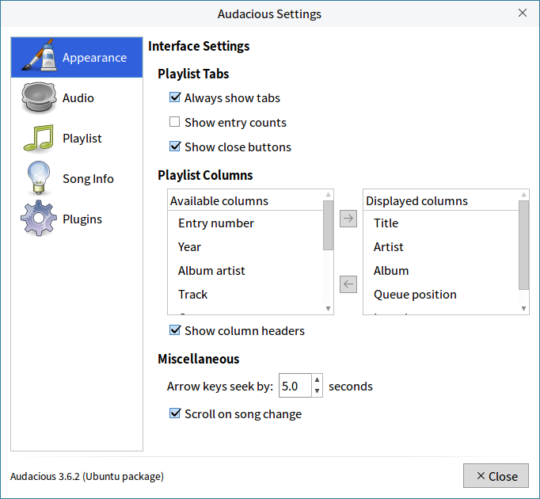
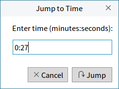

# Audacious
## Overview
Audacious supports various music formats，and provides convenient audio experiences. The interface as shown in Fig 1.

When playing music, the interface as shown in Fig 2.

 

## Basic Function
Icon and function:

| Icon | Function | Icon | Function |
| :------------ | :------------ | :------------ | :------------ |
|| Search || Document Open |
|| Add list | | Start/Pause |
|| Stop || Go backward |
|| Go forward || Repeat |
|| Shuffle || Single repeat |
|| Volume |||

 

### Search
Click "" to open the search interface, as shown in Fig 3.

Input the name of the music at the search box, and select a folder at the bottom left corner, and then click the button “” to show the result.

Double click will add the selected music file to the playlist.

### Add/Open File
Click "" to add a file, and the file will add to the current list, waiting to be played.

Click "" to open a file, which will cover all the contents of the "Now Playing" list, playing immediately. And if there didn't exist "Now Playing" list, it would be created.

### New Playlist
Click "" under the volume button to create a New Playlist.

 

## Advanced Function
Users can make more detailed settings for audacious through the options on the menu bar. Here are brief descriptions for some settings.

### Settings
Click "File" > "Settings" to open the setting window, as shown in Fig 4.

- **Appearance**

1) Playlist Tabs

Always show tabs: Even if there is no playlist now, an empty list will be displayed.

Show entry counts: Show the number of files in current playlist.

Show close buttons: Show the close button near the name of playlist.

2) Playlist Columns: Customize the audio file's informations which will be displayed on the main interface, through left/right arrow between "Available columns" and "Displayed columns".

3) Miscellaneous: Set the amount of rewind/fast forward time when pressing left/right arrow key on the keyboard.

- **Audio**

It's some professional settings, including Output plugin, Bit depth, Replay Gain, Adjust Levels, etc., as shown in Fig 5.

- **Playlist**

It includes Behavior, Compatibility, Song Display, Advanced four parts, as shown in Fig 6.

- **Song Info**

It can set the Album Art and Popup Information, as shown in Fig 7.

- **Plugins**

It provides some detailed settings, as shown in Fig 8.

### Playback
#### Jump to Time
Click "Playback" > "Jump to Time" to go to the specified location, as shown in Fig 9.

#### Jump to Song
Click "Playback" > "Jump to Song" and select a target song in the pop-up window, as shown in Fig 10.

#### Repeat Clip
1) Click "Playback" > "Set Repeat Point A" at the beginning of the clip to be played on repeat.

2) Click "Playback" > "Set Repeat Point B" at the end of the clip to be played on repeat.

3) Audacious will play this clip on a loop. Click "Playback" > "Clear Repeat Points" to cancle it.

### Playlist
#### Sort/Sort Selected
Click "Playlist" > "Sort"/"Sort Selected" to sort by certain rules. The rules provided as shown in Fig 11.

#### Remove
Click "Playlist" > "Remove Duplicates" to remove the duplicates by title, file name or file path.

Click "Playlist" > "Remove Unavailable Files" to remove the terms without available file in this playlist.

### Output
#### Equalizer
Click "Output" > "Equalizer" to customize the values of equalizer, as shown in Fig 12.

### View
Click "View" to select which parts need to show in the main interface, as shown in Fig 13.

 

## Appendix
### Shortcut Key

| Shortcut | Function |
| :------------ | :------------ |
| Ctrl + O | Open files |
| Shift + Ctrl + O | Add files |
| Ctrl + Y | Search library |
| Ctrl + Q | Quit |
| Ctrl + Enter | Play from the start|
| Ctrl + , | Pause |
| Ctrl + . | Stop |
| Alt + ↑ | Previous |
| Alt + ↓ | Next |
| Ctrl + R | Repeat the list |
| Ctrl + G | Repeat the single song |
| Ctrl + S | Random play |
| Ctrl + N | Don't play next one automatically |
| Ctrl + M | Stop after this song |
| Ctrl + I | Song info |
| Ctrl + K | Jump to time	|
| Ctrl + J | Jump to song |
| Ctrl + 1 | Set repeat point A |
| Ctrl + 2 | Set repeat point B |
| Ctrl + 3 | Clear repeat points |
| Shift + Enter | Resume play |
| Ctrl + T | Create a new playlist |
| F2 | Rename the current playlist |
| Ctrl + W | Remove the current playlist |
| Ctrl + P | Playlist Manager |
| Shift + Ctrl + + | Volume up |
| Ctrl + - | Volume down |
| Ctrl + E | Open equalizer setting |
| Shift + Ctrl + M | Show menu bar or not |
| Shift + Ctrl + I | Show info bar or not |
| Shift + Ctrl + S | Show status bar or not |
| Shift + Ctrl + R | Show remaining time or not |
