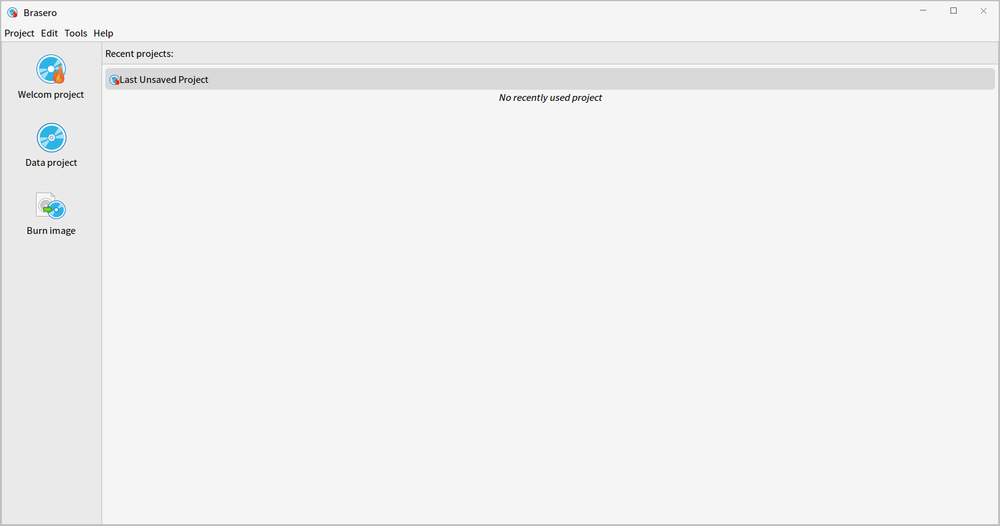
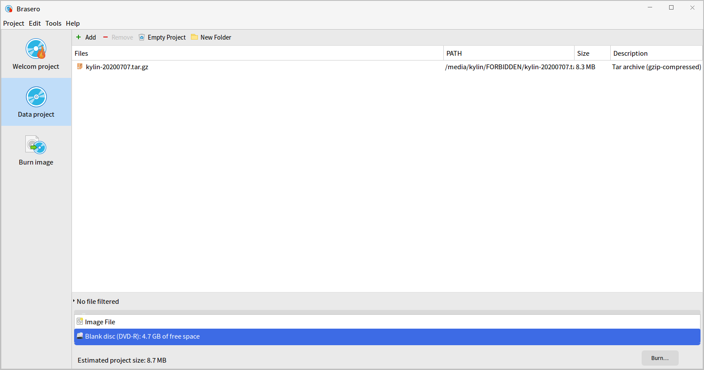
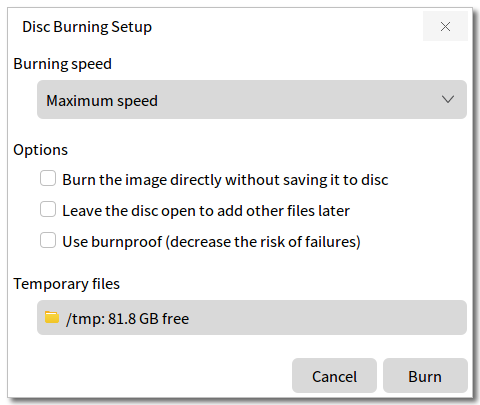
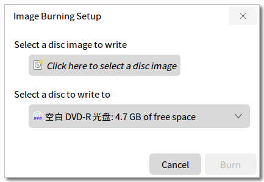
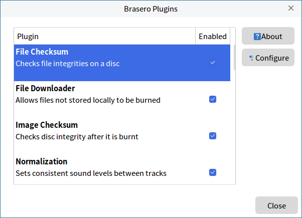
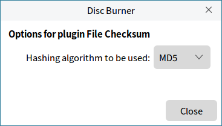
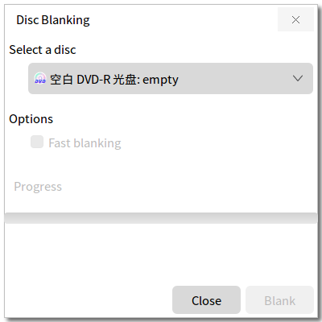
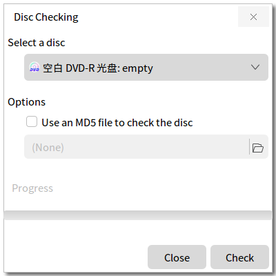

# Kylin Burner
## Overview
Kylin Burner is a tool for burning discs, including data burning and iso burning. It provides users with the ability to burn discs, erase discs, check disc integrity, etc..

 

## Basic Function
There are four options on menu bar: Project, Edit, Tools and Help. The left sidebar has three options: Welcome project, Data project and Burn image. Users can see the latest projects on the main interface.

### Data project
The Data project interface provides four buttons: Add, Remove, Empty project and New Folders.

It will show the files name, size, description and space. The disc type, size, estimated project size will shown at the buttom of this interface.
If to generate a mirror file, the size of the mirror file will be displayed instead of the size of the disc.

Data burning window as shown in Fig 2:

1) Add

Click "Add" to open select files window, and choose files to burn in the project.

2) Remove

Delete the selected files.

3) Empty project

Delete all files in this project.

4) New Folders

Create a new folder in the project.

Click "Burn" and the popup as shown in Fig 3.

### Burn image
Image burning setup as shown in Fig 4:

- 1) Select disc image 

Open the select files interface, and choose the image file.

- 2) Select disc 

When the system recognizes discs, it will be automatically displayed in the selection menu.

- 3) Burn

Click "Burn" to start burning process.

 

## Advanced Function
### Plugins
Click "Edit" > "Plugins", as shown in Fig 5.

Click "About" to show the informations about this plugin, as shown in Fig 6.

Click "Configure" to setup this plugin, as shown in Fig 7.

### Blank
Click "Tools" > "Blank", and only readable and writable discs can be erased.

### Check integrity
Click "Tools" > "Check integrity", and the interface as shown in Fig 9.

 

## Using Tips
1) When using burn image, only the file with the suffix of .iso can be selected.

2) Read-only disc can not be erased.

 

## Appendix
### Shortcut Key

| Shortcut | Function |
| :------------ | :------------ | 
| Ctrl + O| Open |
| Ctrl + S| Save |
| Ctrl + Q| Quit |

