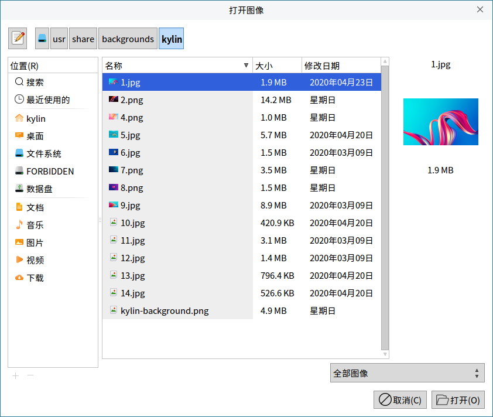
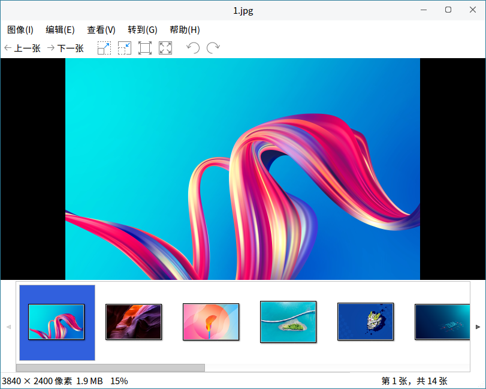
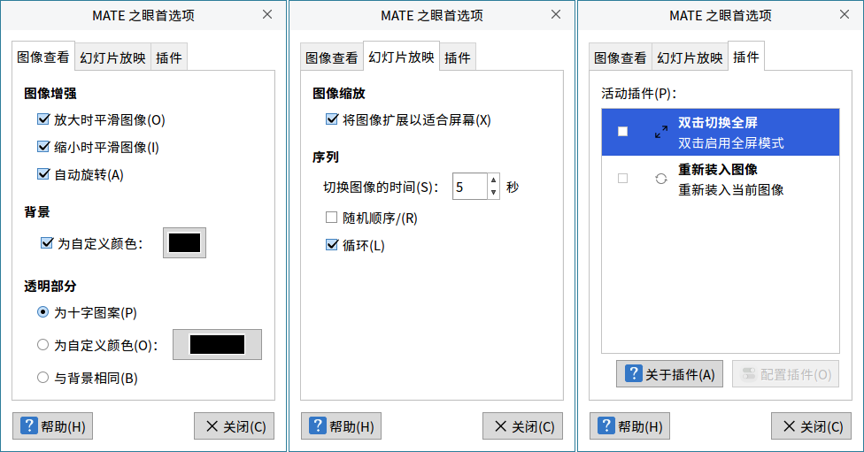

# 图像查看器
## 概 述
图像查看器是一款用来查看图像的软件，能打开多种格式的图片，支持放大、幻灯显示图片、全屏等。主界面如图1所示。

 

## 基本功能
图标及其功能:

|图 标	|图标功能说明	|图 标|	图标功能说明
| :------------ | :------------ | :------------ | :------------ |
||	上一张	||	下一张
||	放大图片||	缩小图片
||	以正常大小显示图片||	使图像适合窗口
||	将图片逆时针旋转90度||将图片顺时针旋转90度

 

点击“图像” > “打开”，可打开选中的图像。如果一次性打开了多张图片，用户可点击“上一张”/“下一张”进行切换查看。图像选择窗口如图 2所示。

## 高级功能
菜单栏上的各个选项，提供了对图片的一些操作。

### 改变格式
点击“图像” > “另存为”，用户可改变当前打开图像的格式，如图 3所示。

### 图 集
当打开某张图片后，再点击“查看” > “图集”，与打开图片同路径下的所有图片都会显示出来，如图 4所示。

#### 首选项
点击“编辑” > “首选项”，进入图像查看器的界面设置。如图5所示，有三个标签页 —— 图像查看，幻灯片放映，插件。

 

## 附 录
### 快捷键

| 快捷键 | 功能 |
| :------------ | :------------ | 
|Ctrl + O | 选择图像并打开
|Ctrl + S | 保存图像
|Shift + Ctrl + S |	将图像另存为
|Ctrl + P | 打印图像
|Ctrl + F8 | 将当前图像设置为桌面背景
|Ctrl + W | 关闭图像查看器
|Ctrl + R | 顺时针旋转90度
|Shift + Ctrl + R | 逆时针旋转90度
| F11 | 全屏查看图像
|Ctrl + + | 放大当前图像
|Ctrl + - | 缩小当前图像
|Ctrl + 0 | 以正常大小显示图片
|F	| 使图像适合窗口
|Alt + Home | 跳转到第一个图像
|Alt + End | 跳转到最后一个图像

