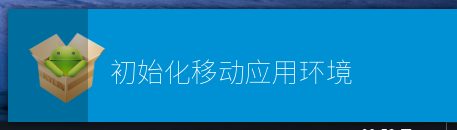
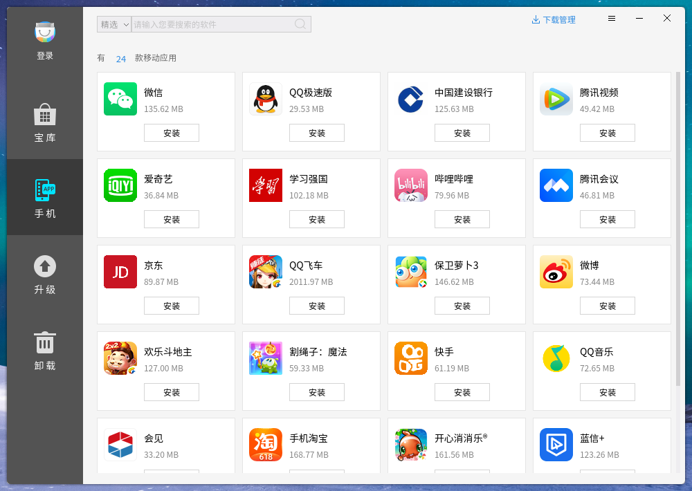
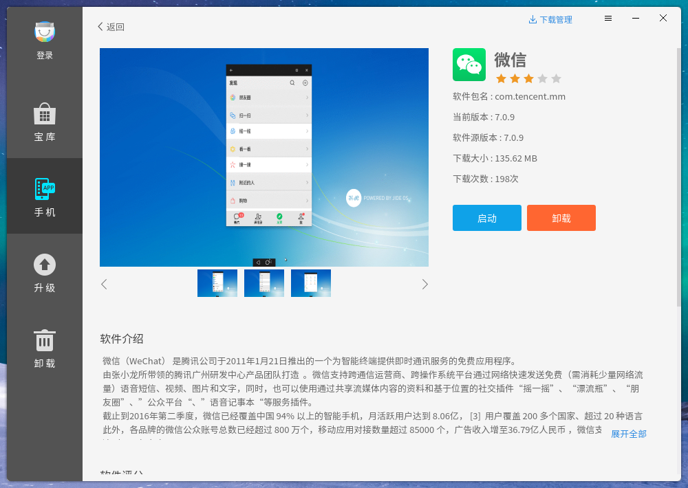

# 麒麟安卓兼容环境
## 概 述
麒麟安卓兼容环境Kydroid是麒麟团队专为“银河麒麟操作系统”打造的一款安卓兼容运行环境，用于解决用户的多样化应用需求。Kydroid 能够让用户在银河麒麟操作系统中安装和运行安卓系统的应用程序，比如安卓游戏、QQ等。

注：部分平台暂不支持安卓兼容。

 

## 功能特性
- 原生性：使用完全原生模式实现，非虚拟机，非安卓模拟器。直接使用硬件资源如显卡硬件加速等，效率极高；

- 高兼容性：支持绝大多数普通APP和部分大型游戏APP;

- 高融合性：体验一体化，安卓App的各项使用体验与银河麒麟桌面应用无差别。如：剪切板互通、通知互通、文件互通、App安装管理融合、任务栏开始菜单融合、Alt+Tab切换融合等；

- 多窗口同时运行：支持多个App同时运行、窗口自由缩放、全屏、横竖屏切换。

- 安卓App生命周期控制：解决App后台恶意自启、互相唤醒等安卓本身缺陷。

 

## 使用说明
### 安卓应用启动
在开始菜单中启动麒麟软件商店，点击窗口左侧“手机”标签页。若为开机后第一次启动应用，则需等待安卓相关文件准备，该过程提示框如图1所示。待安卓环境准备完成后，提示框退出，切换至安卓app界面，如图2所示。

若启动安卓应用时安卓环境已经准备就绪，则直接切换至安卓应用界面。鼠标点击已安装应用上的“启动”按钮，打开应用。可同时打开多款安卓应用，如图3所示。

### 安装和卸载安卓应用
- 安装和升级：在软件商店的“手机”标签页，选择需要安装的应用，点击安装即可。

- 卸载：点击想要卸载的应用，进入软件介绍界面，点击“卸载”按钮。

 

## 常见问题
因安卓操作系统本身技术设计，以及安卓兼容层与银河麒麟操作系统公用硬件资源的原因，为了达到较好的使用体验，我们建议用户注意以下几点：

1）安卓App在使用固态硬盘时性能会比机械硬盘有较大提升（安卓操作系统为手机操作系统，其磁盘操作对机械硬盘支持较差）；

2）建议不要同时运行3个以上的App（安卓手机一般只会有一个App在前端活跃运行）；

3）自由缩放App窗口大小可能出现异常现象（安卓手机上的App形态一般都是全屏，部分App在开发时没有考虑过大小动态改变的情况）；

4）电脑内存建议8G或以上；

5）暂不支持景嘉微等国产显卡。
