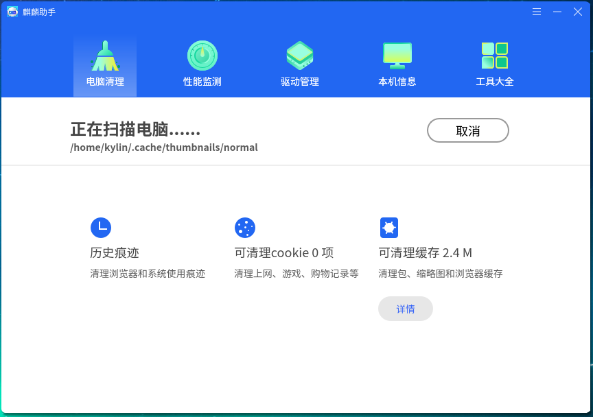
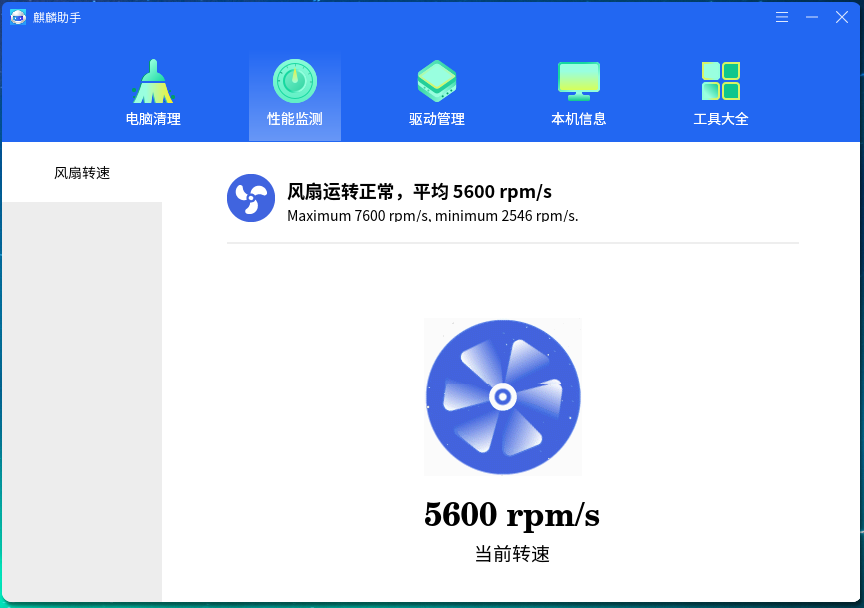
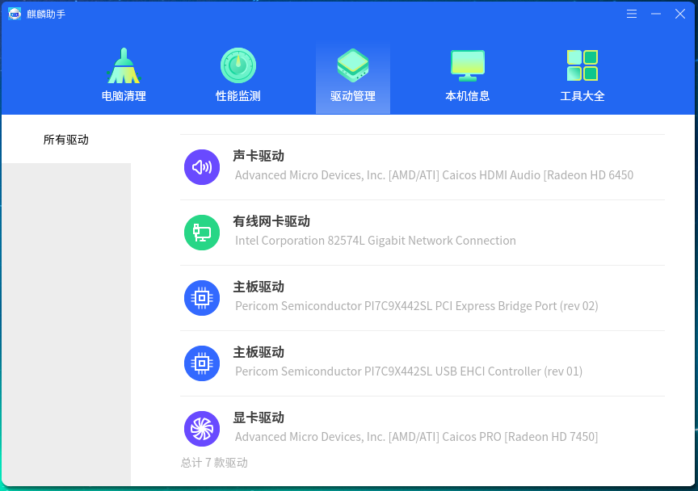
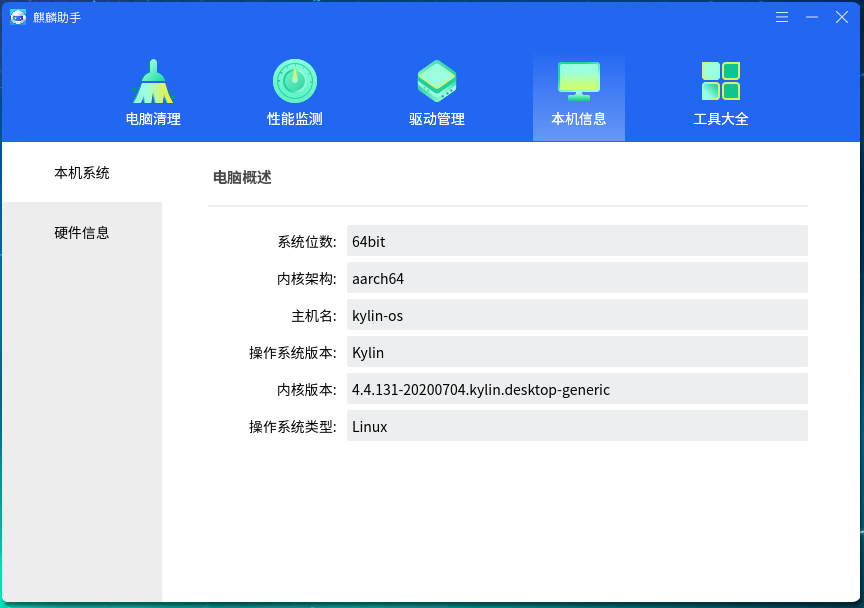
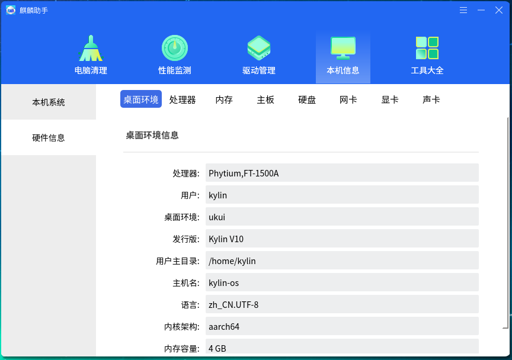
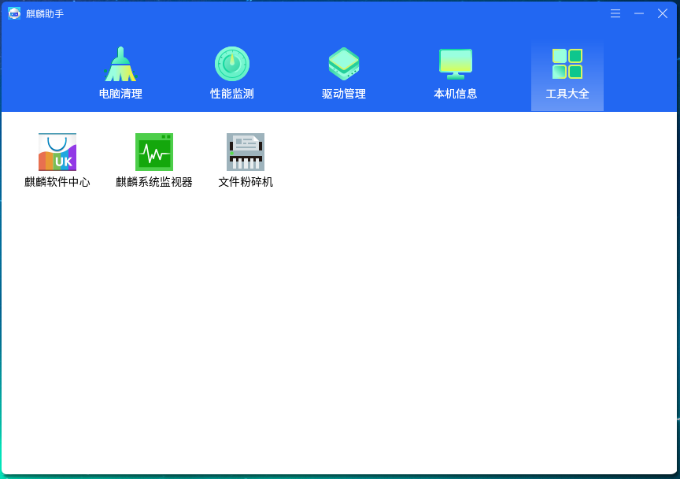

# 麒麟助手
## 概 述
麒麟助手作为系统级工具配置工具，主要针对系统配置进行扩展性加强配置，另外可以实时查询当前计算机的硬件详细信息。主界面如图 1所示。

 

## 电脑清理
“电脑清理”提供“系统缓存”、“Cookies”、“历史痕迹”三个扫描项。

### 系统缓存
点击“系统缓存”图标，弹出选项页面如图 2所示。
 

用户可根据需要进行勾选，只有勾选状态下的选项才会扫描。

### Cookies
点击“Cookies”，弹出选项页面如图 3所示。
 

### 历史痕迹
点击“历史痕迹”，弹出页面如图 4所示。
 

用户可根据需要进行勾选，只有勾选状态下的选项才会扫描。

点击“开始清理”按钮，程序进入扫描状态，如图 5所示。
 

 

## 性能监测
界面如图 6所示。

 

## 驱动管理
界面如图 7所示，显示了计算机中的各个驱动信息。

 

## 本机信息
- 本机系统：从系统底层获取计算机硬件信息以及操作系统信息，主界面如图 8所示。如果该硬件不存在，未从底层获取到该硬件的信息，则不会显示条目。

- 硬件信息：点击相应项目，切换到该硬件的详细信息页面。

 

## 工具大全
“工具大全”作为麒麟助手的功能扩展，使用了插件的开发模式，其中的所有功能均以插件的形式整合，如图 10所示。
 

