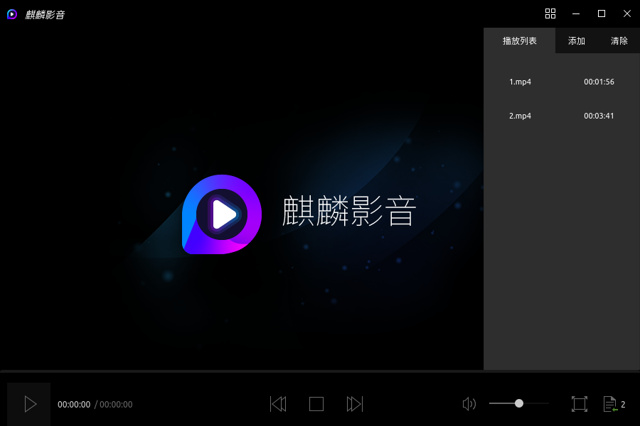
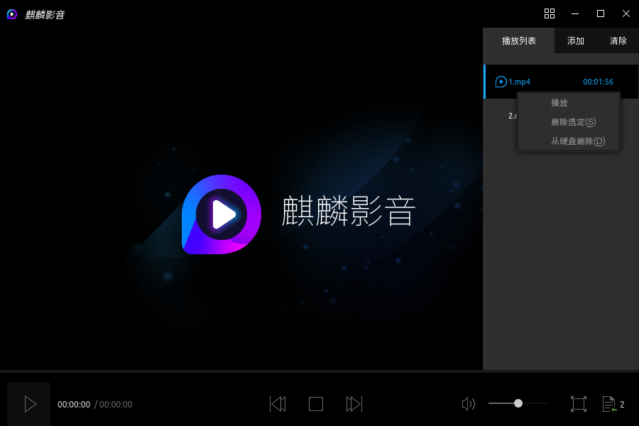
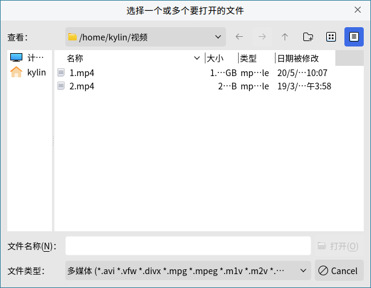
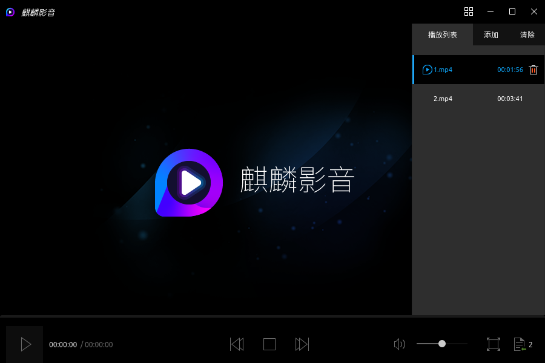
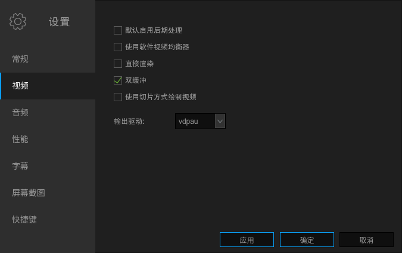
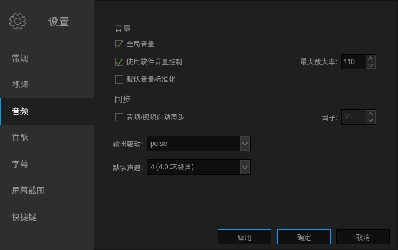
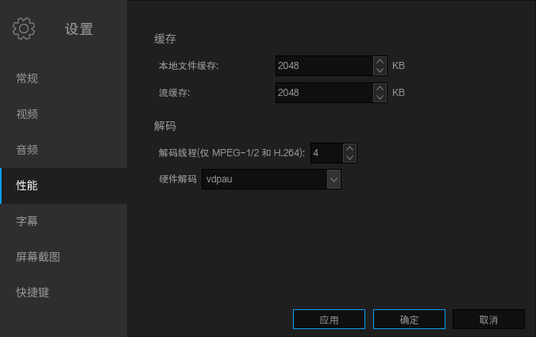
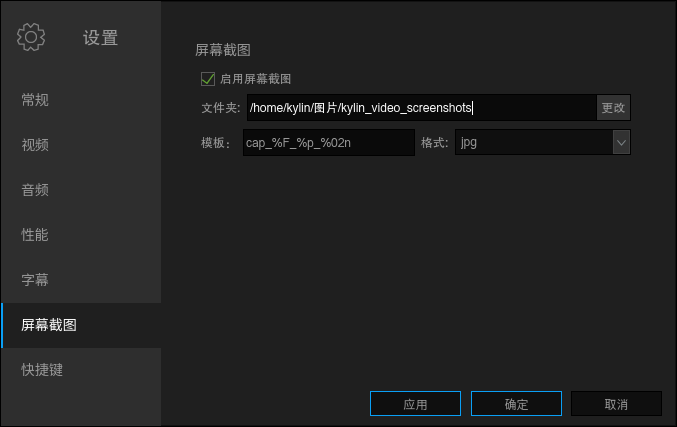
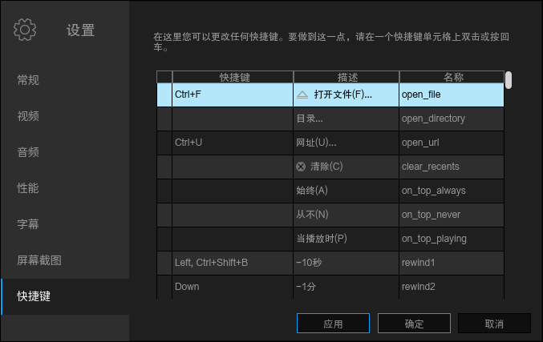
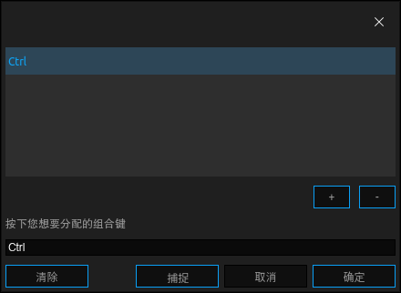

# 麒麟影音
## 概 述
麒麟影音是由麒麟团队开发，基于MPlayer和MPV的一款视频播放软件。主界面简约、直观，如图1所示。

播放影像时的麒麟影音如图2所示。

 

## 基本功能
图标及其功能介绍：

|图 标|	图标功能说明	|图 标	|图标功能说明
| :------------ :| :------------ | :------------ | :------------ |
||	高级功能 | |	播放按钮
||	停止	||	全屏
||	上一个 ||下一个
||	音量调节	||	打开播放列表	|

### 全 屏
点击右下角的“”图标或双击屏幕，即可全屏。

### 播放列表
点击右下角的“”图标，查看播放队列、添加及清除文件，如图3所示。

#### 下拉菜单
在播放列表中单击鼠标右键出现下拉菜单，菜单中功能按钮及其操作内容如下所示。

| 功能按钮 |	操作内容 |
|:------------|:------------|
|播 放|	播放选定的视频|
|删除选定|	从列表中删除选定的视频|
|从硬盘删除|	从列表及硬盘中删除选定的视频|

 

#### 添 加
点击播放列表中“添加”或点击图标“”中“打开文件”选项，进入文件选择窗口，如图4所示。选定后，再点击“打开”即可。

#### 清 除
- 方式一：点击播放列表中“清除”，弹出如图5所示窗口。

- 方式二：移动鼠标至某项，停留的位置将会出现删除图标，点击即可对应删除，如图6所示。

- 方式三：鼠标右键菜单，选择“删除选定”或“从硬盘删除”。

 

## 高级功能
点击麒麟影音主界面右上角的四格图标“” > “设置”，可对软件进行自定义操作。

### 常规设置
常规设置选项可以选择MPlayer、MPV两种播放引擎，并可根据用户需求，选择是否最小化时暂停和视频播放时进行预览。详情如图7所示。

### 视频设置
视频设置提供是否启动后期处理、使用软件视频均衡器、直接渲染、双缓冲、使用切片方式绘制视频，以及输出驱动的选择。详情如图8所示。

### 音频设置
音频设置可根据用户需求对音量（全局音量、使用软件音量控制、默认音量标准化、最大放大率），音频/视频自动同步，输出驱动进行选择。

默认声道：2（立体声）、4（4.0环绕声）、6(5.1环绕声）、7(6.1环绕声）、8(7.1环绕声）、8。

详情如图9所示。

### 性能设置
对缓存和解码进行选择。详情如图10所示。

### 字幕设置
字幕设置可选择自动加载字幕文件（*.srt、*.sub……）的方式，并能设置默认字幕编码，详情如图11所示。

### 屏幕截图设置
截屏截图界面如图12所示。

当有视频正在播放时，点击 > “屏幕截图”，即可对当前画面进行截图保存。

### 快捷键设置
快捷键设置表格允许用户更改大多数现有的动作快捷键，如图13所示。

用户可双击或按回车可进入修改快捷键对话框，详情如图14所示。

### 帮 助
用户可以通过“帮助”选项，查看麒麟影音支持的视频、音频及字幕格式，如图15所示。

 

## 常见问题
### 视频源无法播放
尝试在常规设置中切换播放引擎MPlayer或MPV。

 

## 附 录
### 快捷键
无提示快捷键的部分，可根据用户的需求自定义快捷方式。

|快捷键	|描述|	名称
| :------------ | :------------ | :------------ |
|Ctrl+F|	打开文件（F）	|open_file
|	|目录|	open_directory
|Ctrl+U	|清除（C）	|clear_recents
||	始终（A）|	on_top_always
|	|从不（N）|	on_top_never
|	|当播放时（P）	|on_top_playing
|Left,Ctrl+Shift+B|	-10秒|	rewind1
|Down	|-1分	|rewind2
|PgDown	|-10分	|rewind3
|right,Ctrl+Shift+F	|+10秒|	forward1
|Up	|+1分|	forward2
|PgUp|	+10分|	forward3
|Ctrl+J	|跳转到（J）|	jump_to
|Backspace|	正常速度	|normal_speed
|{|	半速	|halve_speed
|}	|双倍速度|	double_speed
|[|	速度-10%|	dec_speed
|]	|速度+10%|inc_speed
||	速度-4%	|dec_speed_4
||	速度+4%	|inc_speed_4
||	速度-1%	|dec_speed_1
|	|速度+1%	|inc_speed_1
|<,Mesia Previous	|上一个	|play_prev
|>,Media Next	|下一个	|play_next
|	|顺序播放	|order_play
|	|随机播放	|random_play
|	|列表循环播放|	list_loop_play
|	|自动（A）	|aspect_detect
|	|1:1	|aspect_1:1
|	|5:4|	aspect_5:4
|	|4:3|	aspect_4:3
|	|11:8|	aspect_11:8
|	|14:10|	aspect_14:10
|	|3:2|	aspect_3:2
|	|14:9|	aspect_14:9
|	|16:10|	aspect_16:10
|	|16:9|	aspect_16:9
|	|2.35:1|	aspect_2.35:1
|	|禁用（D）|	aspect_none
|	|关（O）|	rotate_none
|	|顺时针旋转90度并翻转（R）	|rotate_clockwise_flip
|	|顺时针旋转90度（C）	|rotate_clockwise
|	|逆时针旋转90度（W）|	rotate_counterclock
|	|逆时针旋转90度并但转（F）|	rotate_counterclockwise_flip
|	|翻转图像（P）|	flip
|	|镜像图像（O）|	mirror
|	|立体声（S）|	channels_stereo
|	|4.0环绕声（4）	|channels_surround
|	|5.1环绕声（5）|	channels_ful51
|	|6.1环绕声（6）|	channels_ful61
|	|7.1环绕声（7）	|channels_ful71
|M,Volume Mute|	静音（M）|	mute
|	|附加立体声（E）|	extrastereo_filter
|	|卡拉OK（K）	|karaoke_filter
|	|音量标准化（N）|	volnorm_filter
|	|优化耳机（h）（earwax）|	earwax_filter
|9	|音量-|	dec_volume
|0	|音量+|	inc_volume
|-	|延迟-|	dec_audio_delay
|+	|延迟+|	inc_audio_delay
|Y	|设置延时（Y）|	audio_delay
|	|加载外部文件（L）|	load_audio_file
|	|卸载外部文件（N）	|unload_audio_file
|	|均衡器（Q）	|audio_equalizer
|	|重置音频均衡器	|reset_audio_equalizer
|	|立体声（S）	|stereo
|	|左声道（L）	|left_channel
|	|右声道（R）|	right_channel
|	|单声道（M）	|mono
|	|反相（v）|	revers_channels
|S	|屏幕截图（S）|	screenshot
|	|加载...|	load_subs
|	|字幕可见性（V）|	sub_visibility
|Shift+I	|在OSD中显示信息（i）|	lshow_info_osd
|Shift+U	|大小+|	inc_osd_scale
|Shift+Y	|大小+|	dec_osd_scale
|	|以毫秒小时时间	|osd_fractions
|	|仅字幕（Y）	|osd_none
|	|音量+定位（S）|	osd_seek
||	音量+定位+计时器（T）|	osd_timer
|	|音量+定位+计时器+总时间（O）|	osd_total
|Ctrl+P	|设置|	show_preferences
|Ctrl+I	|媒体信息（I）|	show_file_properties
|Ctrl+H	|帮助	|show_help
|Ctrl+A|	关于麒麟影音|	chout_kulin_video
|Ctrl+Q	|退出|	quit
|F3|	播放列表	|platlist_open_close
|Space	|播放/暂停|	play_pause
|Media Stop	|停止|	stop
|Ctrl+Return|	全屏|	fullscreen
|	|打开主界面|	open_window
|	|打开截图文件夹|	open_shots_dir

