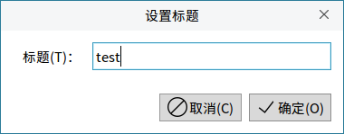
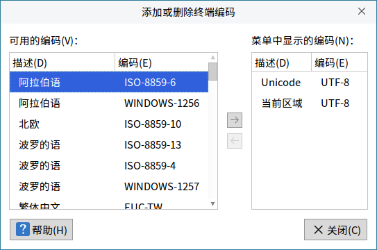
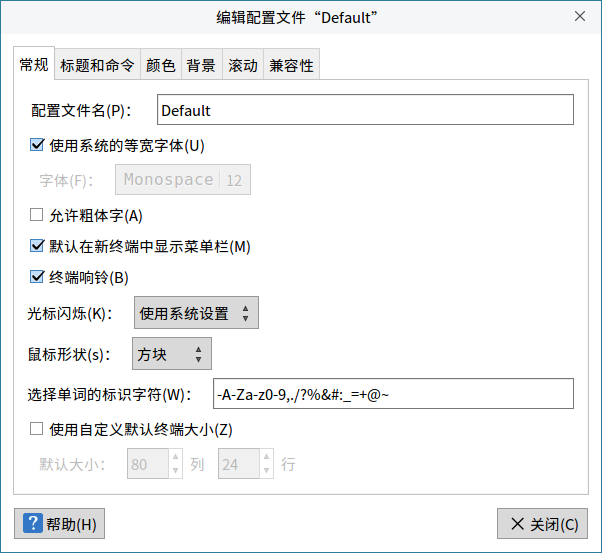
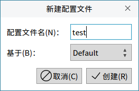

# 终 端
## 概 述
终端提供了在图形界面下的字符系统窗口，主界面如图 1所示。

 

## 基本功能
- 字符系统

- 执行各种命令、脚本

- 使用仅在终端运行的应用/服务

## 高级设置
### 单项设置
仅对当前窗口产生影响，窗口关闭后立即失效。

- 窗口标题

点击菜单栏上的“终端” > “设置标题”，即可修改终端窗口的名称。如图 2所示。

- 字符编码

字符编码也称字集码，是把字符集中的字符编码作为指定集合中的某一对象，以便文本在计算机中显示和传递。

点击菜单栏上的“终端” > “设定字符编码”，用户可对编码进行调整。

在“添加或删除”中，可看到更多的编码选项。

- 调整窗口大小

点击菜单栏上的“查看”，可设置当前窗口全屏、放大、缩小。此处的放大/缩小，会连带着窗口中的文本一起放大/缩小。

### 配置文件

配置文件中的设置是永久生效的，并适用于所有新建窗口。应用自带了Default配置文件。用户可通过“编辑” > “配置文件首选项”，修改配置。

也可通过“文件” > “新建配置文件”，或“编辑” > “配置文件”，基于某个配置文件创建新配置。

 

## 常见问题
### 输出内容过多时，滚动查看不完全
这是对回滚的列数做了限制导致的。

选择“编辑” > “配置文件首选项” > “滚动”标签页，在“回滚”处勾选“不限制”，这样就可以回滚到开头，完整查看。

 

## 附 录
### 快捷键

|  快捷键 |  功能|
| :------------ | :------------ |
| Ctrl + Alt + T  |  打开新终端窗口 |
| Ctrl + Shift + T | 在终端窗口中打开新标签页  |
| Ctrl + D  | 关闭当前窗口/标签页  |
| F11  |  全屏显示/退出全屏 |

更多快捷键可通过“编辑” > “键盘快捷键”查看或修改。

