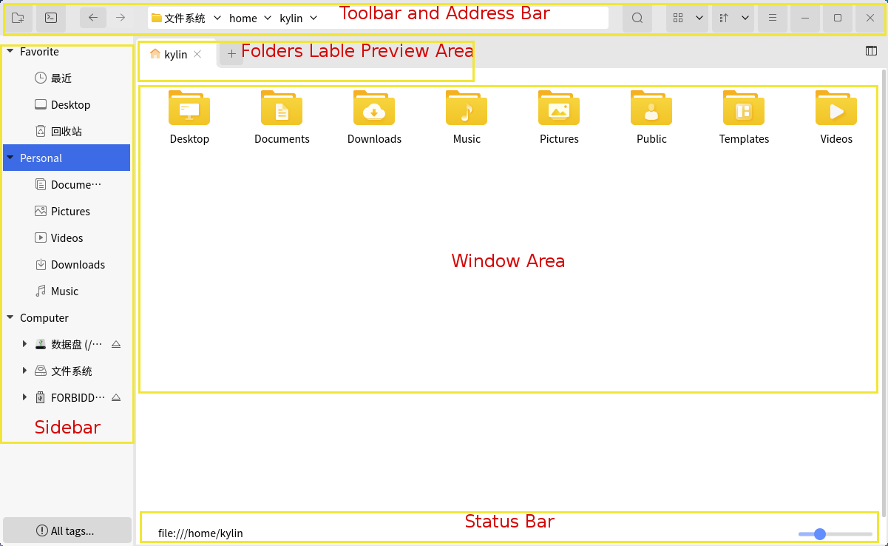
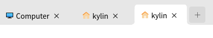
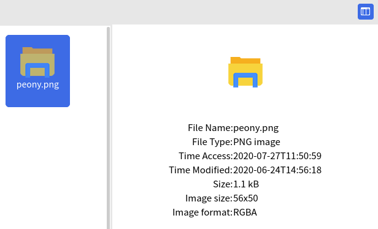
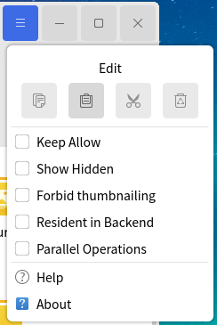

# Peony
## Overview
Peony(files browser) can view files and folders on the system by category, and supports the general opearations for files and folders. The main interface as shown in Fig 1.

## Basic Points
### File Name
- The maximum length of filename is 255 characters, usually composed by letters, numbers, ".(dot)", "\_(underline)", "-".

- Filename can't include "/"; Because "/" means root directory or the separator in a path.

### Path
- Quote filename directly when the file is in current directory; And use file in other directory by specifying its directory.

- Absolute path is certain while relative path depends on working directory.

- Each directory has file "." means current location and file ".." means previous location.

Absolute path -- Start from root directory, for example: "/home/kylin/test"

Relative path -- Start from current directory, for example: (locate at /home) "kylin/test"

When locate at /etc, it can be expressed as "../home/kylin/test"

### File Type
Supported types as shown below:

| Type | Description |
| :------------ | :------------ |
| Normal file | Including text files, data files, executable binary program, etc. |
| Directory file | Regarded as special files, and consist hierarchical tree structure of the system |
| Device file | Recognize devices and drivers, and enable the kernel to communicate with hardware devices |
| Symbolic link | Store the path to a system file; When call the symbolic link, the system will access the path saved in it automatically |

 

## Window Composition
It can be divided into five parts: toolbar and address bar, folders lable preview area, sidebar, window area and status bar.

 

### Toolbar and Address Bar
Icon and Function:

| Icon | Function | Icon | Function |
| :------------ | :------------ | :------------ | :------------ |
|  | Create a new folder | | Open the terminal |
|  | Back to the previous directory |  | Forward to the next directory |
|   | Search box |  | Set view method |
|  | Set sort method |  | Advanced settings |

 

### Folders Lable Preview Area
Users can view the opened folders in the current window, and click "+" to create a page same as the current opened page, as shown in Fig 3.

### Sidebar
Sidebar lists the directories by the form of tree's hierarchy. External mobile devices and remote shared devices are also shown here.

### Window Area
It lists the sub directories and files of the current directory. Clicking one directory in the sidebar, the contents of it will be shown here.

### Status Bar
1) When enter one directory, it shows the current path.

2) When select one folder, it shows the folder's name.

3) When select one file, it shows the name and size of this file.

### Detail
Select one file, and click "" can see the detail informations about this file, as shown in Fig 4.

 

## Basic Function
### View Files and Folders
View and manage local files, local storage devices (such as external hard disk), file server, and files in network sharing. 

View any file's contents by double clicking (or open it by the default application). Right clicking can choose to open it in a new tab / new window.

#### View Mode
The system shows all files and directories through "Icons" mode by default.

- Icons: The form is "Big icon + File name".

- List: The form is "Small icon + File name + File informations"

#### Sort Mode
Users can change it by "" button on the toolbar.

Sort ways introduction:

1) By Name: Alphabetical file name.

2) By Size: Sort by the amount of disk space occupied by the file; From minimum to maximum by default.

3) By Type: Merge similar files together and sort by name.

4) By Date Modified: Sort by the last time to modify files; From the oldest to newest by default.

### Search Files
- Basic search:

Click "", and input the key words in the box. Press "Enter" to search in the current path.

- Advanced search:

Click "more options" to add more rules, as shown in Fig 8.

### Files and Folders General Operations
1) Copy

* Way 1：Select file and right click > "Copy" > right click at destination > "Paste"

* Way 2: Select file, Ctrl+C > Destination, Ctrl+V

* Way 3: Drag file from original location to the destination.

In way 3, if the two locations are both on a same hard disk, the file will be moved (press Ctrl to copy); If drag from U disk to the system, the file will be copied (because they are two different devices).

2) Move

* Way 1: Select file and right click > "Cut" > right click at destination > "Paste"

* Way 2: Select file, Ctrl+X > Destination, Ctrl+V

3) Delete

Move to trash:

* Way 1: Select file and right click > "Delete to Trash"

* Way 2: Select file, Delete

* Way 3: Drage to Trash on the desktop

If the deleted files are on a removable device, and eject this device without emptying trash, those files will be seen in the trash when re-insert the device to the current system.

Permanently delete:

* Way 1: Delete in trash

* Way 2: Select file, Shift + Delete

4) Rename

* Way 1: Select file and right click > "Rename"

* Way 2: Select file, F2

Press Ctrl + Z to revoke rename.

## Advanced Function
Click "" to enter the setting interface.
 

 

## Appdenix
### Shortcut Key

| Shortcut | Function |
| :------------ | :------------ |
| Ctrl + C  | Copy |
| Ctrl + X  | Cut |
| Ctrl + V  | Paste |
| Delete  | Delete |
| Shift + Delete  | Permanently Delete |
| Ctrl + Z  | Revoke |
| Ctrl + A  | Select All |
| F2  | Rename |

### Wildcard Description

| Wildcard | Description |
| :------------ | :------------ |
| * | Match 0 or multiple charaters |
| ? | Match any charater |
| [abl A-F] | Match any charater listed in the square brackets. This example represents any charater in a, b, l and captial letter from A to F |

