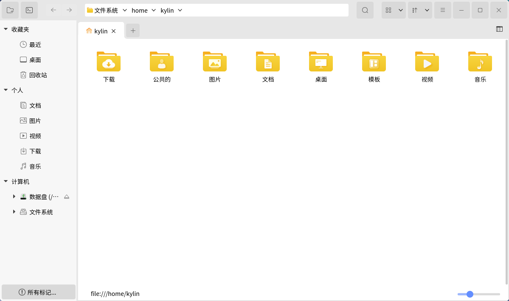

# 文件管理器
## 概 述
文件管理器可以分类查看系统上的文件和文件夹，支持文件和文件夹的常用操作，其主界面如图 1所示。

## 基本要点
### 文件名

- 系统文件名长度最大可以为255个字符，通常是由字母、数字 、“.(点号)”、“_(下划线)” 和“-(减号)”组成的。

- 文件名不能含有“/”符号；因为“/”在操作系统目录树中，表示根目录或路径中的分隔符号。

### 路 径

- 使用当前目录下的文件时，可以直接引用文件名；如果要使用其他目录下的文件，就必须指定该文件所在的目录。

- 绝对路径是一定的，相对路径是随着用户工作目录改变的。

- 每个目录下都有代表当前目录的“.”文件，和代表当前目录上一级目录的“..”文件。

绝对路径 —— 从根目录开始的路径，比如“/home/kylin/test”。

相对路径 —— 从当前所在目录开始的路径，比如位于/home目录下时，test文件的相对路径为“kylin/test”。

当位于/etc目录下，test文件的相对路径则表示为“../home/kylin/test”。

### 文件类型
系统支持如下表中的文件类型：

| 文件类型  | 说明  |
| :------------ | :------------ |
| 普通文件  | 包括文本文件、数据文件、可执行的二进制程序等  |
| 目录文件（目录）  | 系统把目录看成是一种特殊的文件，利用它构成文件系统的分层树型结构  |
| 设备文件（字符设备文件/块设备文件） | 系统用它来识别各个设备驱动器，内核使用它们与硬件设备通信  |
| 符号链接 | 存放的数据是文件系统中通向某个文件的路径；当调用符号链接文件时，系统将自动访问保存在文件中的路径|

 

## 窗口组成
文件管理器窗口可划分为工具栏和地址栏、文件夹标签预览区、侧边栏、窗口区和状态栏五个部分，如图 2所示。

### 工具栏和地址栏
图标及其功能：

| 图标 | 功能说明 | 图标 | 功能说明 |
| :------------ | :------------ | :------------ | :------------ |
||	新建文件夹	||	打开终端
||	后退	||	前进
||	搜索文件夹、文件等，提供高级搜索功能	||	选择视图模式
||	选择排序方式	||	高级设置
	
 

### 文件夹标签预览区
用户可查看当前窗口已打开的文件夹标签页，点击 “+” 图标可以再打开一个与相邻标签页相同的页面，如图 3所示。

### 侧边栏
侧边栏列出了树状的目录层次结构，提供对操作系统中不同类型文件夹目录的浏览。外接的移动设备、远程连接的共享设备也会在此处显示。

### 窗口区
窗口区列出了当前目录节点下的子目录、文件。在侧边栏列表中单击一个目录，其中的内容应就会在此处显示。

### 状态栏
（1）进入某个目录时，显示当前位置的路径。

（2）选中某个文件夹时，显示该文件夹的名称。

（3）选中某个文件时，显示该文件的名称和大小。

（4）右下角的滑动条为缩放条，可对图标大小进行拖动调节。

### 详细信息
选中某个文件后，点击详细信息图标“”，即可对文件详情预览，如图 4所示，包含文件名、大小、尺寸等信息。

 

## 主要功能
### 查看文件和文件夹
用户可以使用文件管理器查看和管理本机文件、本地存储设备（如外置硬盘）、文件服务器和网络共享上的文件。

在文件管理器中，双击任何文件夹，可以查看其内容（使用文件的默认应用程序打开它）；也可以右键单击一个文件夹，在新标签页或新窗口中打开它。

#### 视图模式
默认情况下，系统以图标形式显示出所有的文件和目录。

- 在图标视图中，文件浏览器中的文件将以“大图标+文件名”的形式显示。

- 在列表视图中，文件浏览器中的文件将以“小图标+文件名+文件信息”的形式显示。

#### 排序方式
浏览时，用户可以用不同的方式文件进行排序。单击工具栏上的“”图标来更改，如图 6所示。

各种文件排序方式介绍如下：

（1）按名称排序：按文件名以字母顺序排列。

（2）按文件大小排序：按文件大小（文件占用的磁盘空间）排序；默认情况下会从最小到最大排列。

（3）按文件类型排序：按文件类型以字母顺序排列；会将同类文件归并到一起，然后按名称排序。

（4）按修改日期排序：按上次更改文件的日期和时间排序；默认情况下会从最旧到最新排列。

（5）升序/降序：选择排序方式后，可同时选择升序或者降序。

### 文件搜索
- 基础搜索：

点击“”按钮，切换到搜索输入框。搜索框中输入内容，然后按Enter键，即可在当前目录进行搜索，如图 7所示。

- 高级搜索：

（1）点击“更多选项”，用户可添加自定义条件，如图 8所示。

（2）点击“”按钮，可设置是否进行递归搜索。

### 文件和文件夹常用操作
（1）复 制

* 方式1：选中文件，右键单击 > “复制” > 目标位置，右键单击 > “粘贴”

* 方式2：选中文件，Ctrl+C > 目标位置，Ctrl+V

* 方式3：从项目所在文件夹窗口拖动至目的文件夹窗口

在方式3中，如果两个文件夹都在计算机的同一硬盘设备上，项目将被移动；如果是从U盘拖拽到系统文件夹中，项目将被复制（因为这是从一个设备拖拽到另一个设备）。要在同一设备上进行拖动复制，需要在拖动同时按住Ctrl键。

（2）移 动

* 方式1：选中文件，右键单击 > “剪切” > 目标位置，右键单击 > “粘贴”

* 方式2：选中文件，Ctrl+X > 目标位置，Ctrl+V

（3）删 除

删除至回收站：

* 方式1：选中，右键单击 > “删除到回收站”

* 方式2：选中，Delete

* 方式3：选中，拖入桌面上的“回收站”

若删除的文件为可移动设备上的，在未进行清空回收站的情况下弹出设备，可移动设备上已删除的文件在其他操作系统上可能看不到，但这些文件仍然存在；当设备重新插入删除该文件所用的系统时，将能在回收站中看到。

永久删除：

* 方式1：在“回收站”中再删除

* 方式2：选中，Shift+Delete

（4）重命名

* 方式1：选中，右键单击 > “重命名”

* 方式2：选中，F2

若要撤销重命名，按Ctrl+Z即可恢复。

 

## 高级设置
点击工具栏上“”图标，打开设置选项，如图 9所示。

 

## 附 录
### 快捷键

| 快捷键  | 功能  |
| :------------ | :------------ |
| Ctrl + C  | 复制  |
| Ctrl + X  | 剪切  |
| Ctrl + V  | 粘贴  |
| Delete  | 删除  |
| Shift + Delete  | 永久删除  |
| Ctrl + Z  | 撤销  |
| Ctrl + A  | 全选  |
| F2  | 重命名  |
| Ctrl + F | 启动搜索框 | 
| Ctrl + N | 打开新窗口 | 
| Ctrl + W | 关闭当前窗口 | 
| Ctrl + 鼠标滚轮 | 更改图标大小 |
| Ctrl + Shift + N | 新建文件夹 |
| Alt + Enter | 打开“属性”对话框 |
| Alt + → | 查看下一个历史目录 |
| Alt + ↑ | 查看上一层目录 |
| Alt + ←（或Backspace） | 查看上一个历史目录 |
| F11 | 最大化或最小化窗口 |

### 通配符说明

| 通配符 | 说明 |
| :------------ | :------------ |
| 星号（*） |	匹配零个或多个字符 |
| 问号（?） |	匹配任何一个字符 |
| [abl A-F]	| 匹配任何一个列举在方括号中的字符，示例中表示a、b、l或任何一个从A到F的大写字符 |

### 系统部分目录简要介绍
1）/bin：存放普通用户可以使用的命令文件。

2）/boot：包含内核和其它系统程序启动时使用的文件。

3）/dev：设备文件所在目录。在操作系统中设备以文件形式管理，可按照操作文件的方式对设备进行操作。

4）/etc：系统的配置文件。

5）/home：用户主目录的位置，保存用户文件，包括了配置文件、文档等。

6）/lib：包含许多由/bin中的程序使用的共享库文件。

7）/opt：存放可选择安装的文件和程序，主要是第三方开发者用于安装他们的软件包。

8）/root：系统管理员（root或超级用户）的主目录。

9）/usr：包括与系统用户直接相关的文件和目录，一些主要的应用程序也保存在该目录下。

10）/var：包含一些经常改变的文件。如假脱机（spool）目录、文件日志目录、锁文件和临时文件等。
