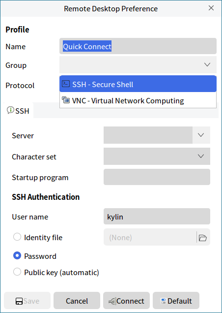
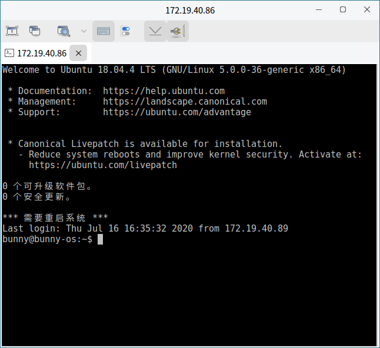
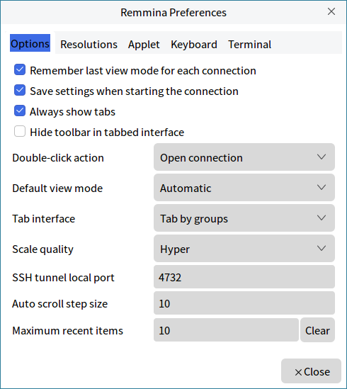

# Remmina
## Overview
Remmina provides the function that connect to remote computers through VNC (graphic) or SSH (terminal). The main interface as shown in Fig 1.

 

## Basic Function
Icon and Function:

| Icon | Function | Icon | Function |
| :------------ | :------------ | :------------ | :------------ |
|| Connect to the selected remote desktop || Create a new connection |
|| Copy a connection || Edit a connection
|| Delete || Open preferences

 

### New Connection Steps
Taking SSH, connect to the computer with IP address 172.19.40.86 for example.

1) Ensure the sshd service is running on two computers.

Click "" and the preferences window as shown in Fig 2.

2) Select SSH

"Server" box : Input IP address 172.19.40.86

"SSH Authentication" - "User name" : Input the name of connected computer

Click "Connect" and input the password of connected computer. If it's first time to connect to this computer, users are needed to trust the new public key.

3) After authenticated, the interface as shown in Fig 4.

### Preferences
Click "" or "Edit" > "Preferences" to customize the remmina settings, as shown in Fig 5.

 

## Advanced Function
### View
Click "View" to select the items displayed on the window.

### Import & Export
Click "Tools" > "Import" to import a file of other connection, or click "Tools" > "Export" to generate a configuration file from a connection.

### Plugins
CLick "Tools" > "Plugins" to see the current plugins' informations, such as name, type, etc., as shown in Fig 7.

 

## Appendix
### Shortcut Key

| Shortcut | Function |
| :------------ | :------------ |
| Ctrl + O | Connect |	
| Ctrl + N | New |	
| Ctrl + C | Copy |	
| Ctrl + E | Edit |	
| Ctrl + D | Delete |	
| Ctrl + X | Quit |	
| Ctrl + P | Preferences |	
