# 小工具
## 茄子摄像头概述
茄子摄像头是一款用摄像头拍照片和录制视频的系统应用软件，可添加眩晕、弯曲之类的视觉效果。主界面如图 1所示。

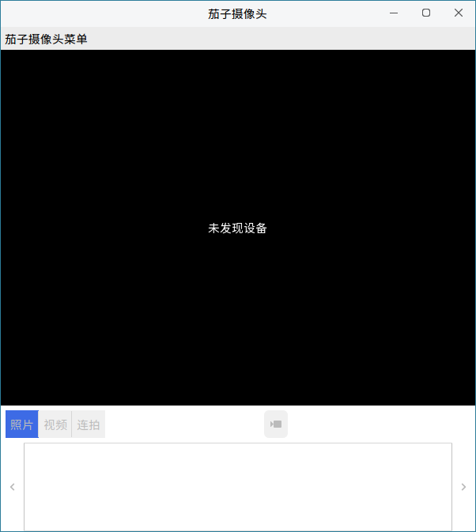

### 基本功能
图标及其功能介绍:

|图标	|图标功能说明|	图标|	图标功能说明
| :------------ | :------------ | :------------ | :------------ |
||	照片、视频、连拍模式设置||		摄像头

 

#### 茄子摄像头菜单
用户可以通过点击“茄子摄像头菜单”进入到菜单选项，如图 2所示。

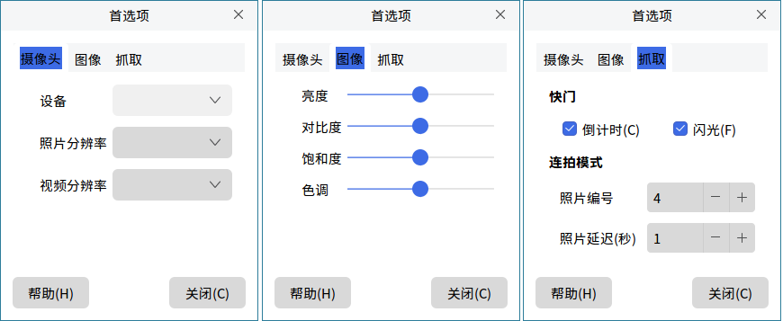

- **首选项**

用户可以通过点击：茄子摄像头菜单 > 首选项，根据需求对摄像头、图像及抓取等参数进行设置，如图 3所示。

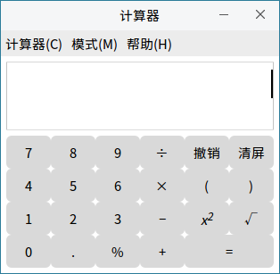

### 附 录
#### 快捷键

|选项	|快捷键|	操作内容
| :------------ | :------------ | :------------ |
|全屏（F）|F11|	将茄子摄像头投放到全屏
|退出（Q）|	Ctrl+Q|	退出茄子摄像头

 
 

## MATE计算器概述
MATE计算器是一款提供基本、高级、财务、编程四种模式的计算器工具软件。主界面由标题栏（最小化、关闭）、菜单、数据显示区及计算操作区构成，如图 4所示。

### 基本功能 
#### 首选项

用户可以通过点击：菜单 > 计算器 > 首选项，根据需求对数字格式（自动、定点数、科学、工程）、角度单位（角度、弧度、百分度）、字长（8位、16位、32位、64位）等进行设置，如图 5所示。

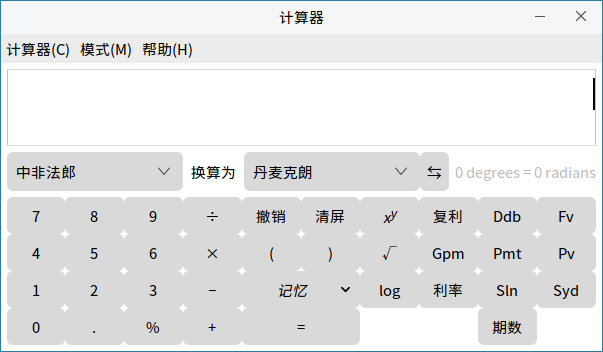

#### 模 式
- **高级模式**

高级模式可以进行更加丰富方式进行快捷计算，如图 6所示。

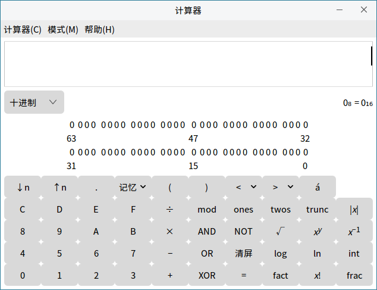

- **财务模式**

财务模式是针对财务相关的快捷计算，如图 7所示。

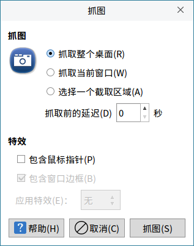

- **编程模式**

编程模式是针对编程相关的快捷计算，如图 8所示。

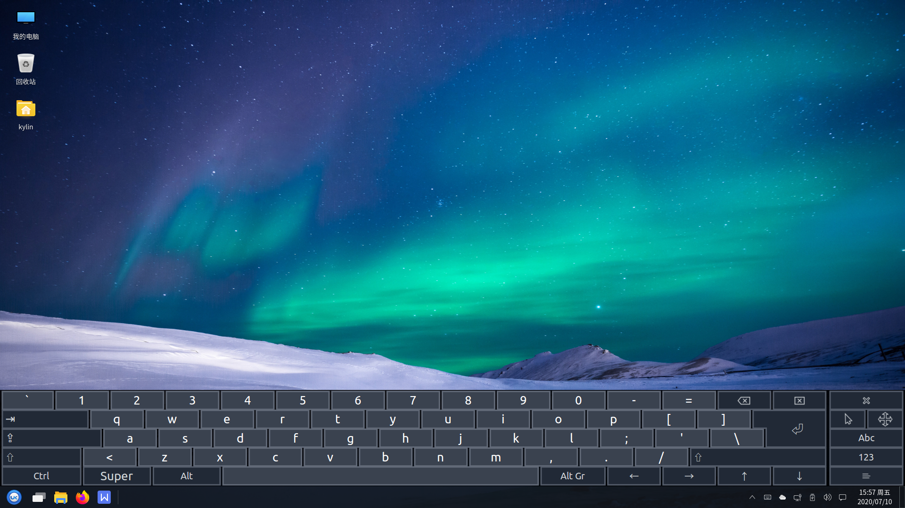

### 附 录
#### 快捷键

|选项	|快捷键	|操作内容
| :------------ | :------------ | :------------ |
|复制（C）|	Ctrl+C|	复制计算内容
|粘贴（P）|	Ctrl+V|	粘贴当前复制内容
|撤销（U）|	Ctrl+Z|	撤销当前计算
|重做（R）|	Shift+Ctrl+Z|	重新计算
|退出（Q）|	Ctrl+Q	|退出MATE计算器

 
 

## 抓图概述
抓图是一款用于截图的工具软件，可以抓取整个桌面、当前窗口或截取区域，可设置延时抓图，并且可以设定相关特效，如：是否包含鼠标指针、是否包含窗口边框。主界面包括图片抓取方式设置、特效设置及功能按钮三个部分，如图 9所示。

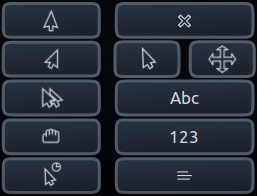

### 基本功能
#### 抓 图
- **抓取整个桌面**

抓取整个桌面是对整个桌面的抓取，可设置抓取前的延时（秒），特效：包含鼠标指针。

- **抓取当前窗口**

抓取当窗口是对当前打开窗口进行窗口截图，可设置抓取前的延时（秒），特效：包含鼠标指针、包含窗口边框，如图 10所示。

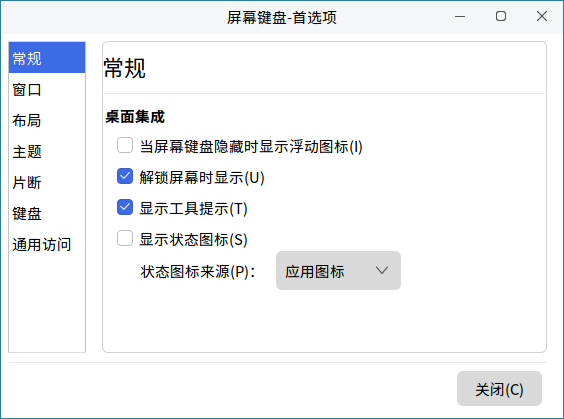

- **选择一个截取区域**

选择一个截取区域是对当前页面选取部分区域进行截图，操作即刻生效，如图 11所示。

### 附 录
#### 快捷键

|选项	|快捷键|	操作内容
| :------------ | :------------ | :------------ |
|抓取整个桌面	|打印	|对整个桌面的抓取
|抓取当前窗口	|Ctrl+打印|	对当前打开窗口进行窗口截图
|选择一个截取区域	|Shift+打印	|对当前页面选取部分区域进行截图

 
 

## 屏幕键盘概述
屏幕键盘是一款系统应用软件，用户可以通过屏幕上显示的软键盘，实现键盘输入功能。屏幕键盘主界面如图 12所示。

### 基本功能
图标及其功能介绍：

|图标	|图标功能说明	|图标	|图标功能说明
| :------------ | :------------ | :------------ |:------------ |
||	大写开启与关闭||键盘大写及常用符号开启（单击）与固定（双击）
||	显示连接到此计算机的驱动器和硬件（单击选择主菜单开启、双击固定主菜单）	||	固定Alt键
||	删除操作	||	关闭操作
||	回车	||	隐藏屏幕键盘
||	切换单击帮助程序	||	移动屏幕键盘
||	主键盘	||	数字键盘和片段
||	设置片段以便快捷输入（类搜狗输入法快捷用语）||||

 

#### 大写开启与关闭
用户通过点击“”图标，可以对键盘的大小写进行设定，如图 13所示。

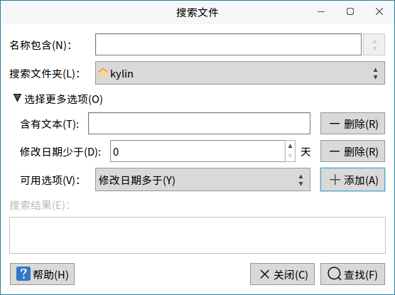

#### 切换单击帮助程序
用户通过点击“”图标，切换单击帮助程序，如图 14所示。

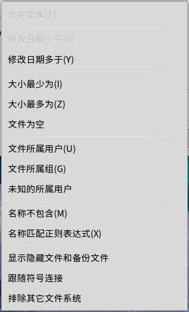

图标及其功能介绍：

|图标|	图标功能说明| 	图标|	图标功能说明
| :------------ | :------------ | :------------ |:------------ |
||	中键单击	||	右击
||双击	||	拖拽点击
||激活悬停单击||||

#### 片 段
用户通过点击“”图标，添加常用语，如图 15所示。

#### 首选项
用户通过点击“”图标，可对屏幕键盘的常规、窗口、布局、主题等进行设置，如图 16所示。

 
 

## 搜索文件概述
搜索文件提供了以多种规则在对应目录中查找相关文件的功能，主界面如下图所示：

### 基本功能
在“名称包含”框中输入内容，并指定要搜索的文件夹，点击“查找”，即会出现内容。如下图所示：

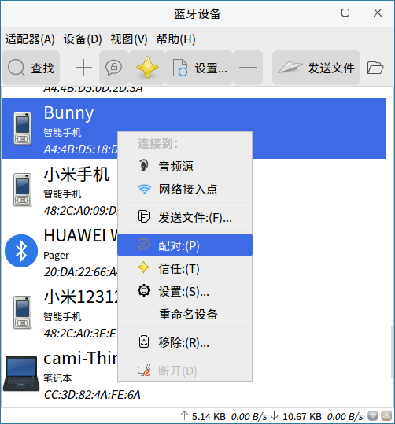

### 高级功能
点击“选择更多选项”，打开折叠菜单，可根据用户需要，添加多个限制条件。选择选项后，点击右侧的“添加”/“删除”按钮，即可添加或删除该选项，如下图所示：

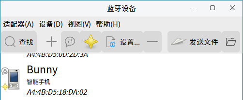

搜索文件提供的高级选项如下所示：

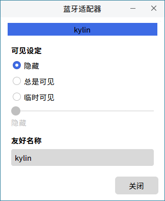
 
 

## 桌面共享概述
桌面共享是一款网络应用软件，可以对桌面共享进行相关设置。主界面如图 21所示。

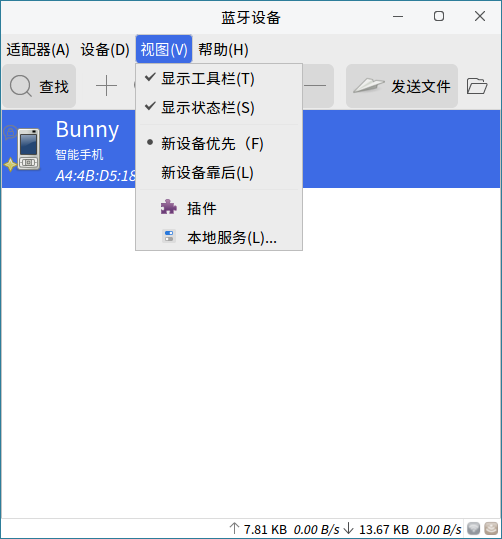

### 基本功能
桌面共享可对共享、安全及显示通知区域图标三部分进行设置。

#### 共 享
用户在共享桌面时，勾选“允许其他人查看您的桌面”即可，如图22所示。

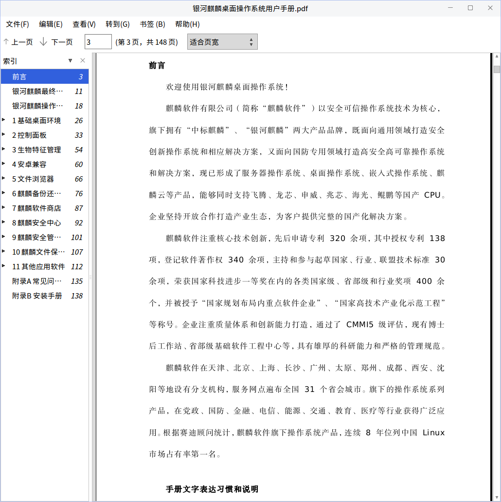

#### 安 全
在安全设置区域，默认勾选“您必须为本机器确认每次访问”，同时可以根据用户需求，设置密码、自动配置UPnP路由器开放和转发端口。

#### 显示通知区域图标
用户在桌面共享时，可以设定显示通知区域图标的显示状态：总是、只在有用户连接时（默认）、永不。

 
 

## 麒麟天气概述
麒麟天气是一款帮助用户获取天气预报的软件，通过图形界面的城市管理和搜索，方便用户快速获取城市天气信息及生活指数信息，如：每周气候、穿衣指数、感冒指数、紫外线指数、洗车指数、空气指数、运动指数等。

麒麟天气的主界面如图 23所示。

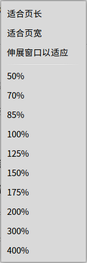
 

### 基本功能
#### 搜索城市或地区
点击右上角搜索框，键入用户需要搜索的城市或地区，在用户键入的同时列出相关城市的筛选列表，如图 24所示。

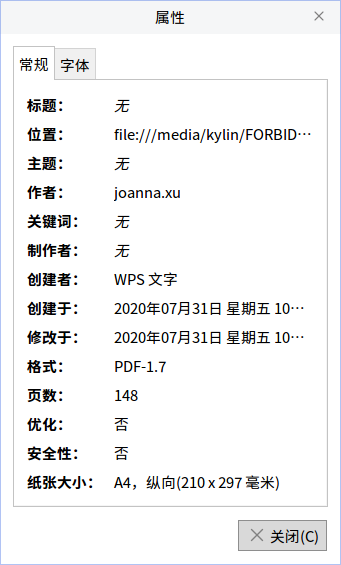

点击麒麟天气城市管理，将为用户提供图形化管理界面如图 25所示，用户可以更具需要收藏需要关注的城市天气。

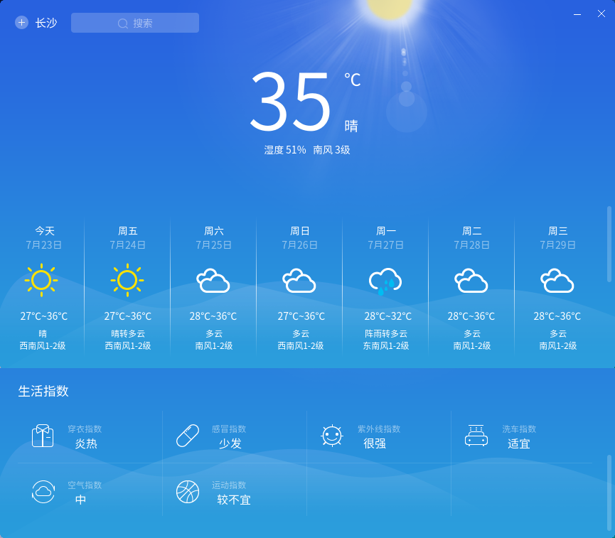

 
 

## 蓝牙管理器概述
蓝牙管理器是一款系统应用软件，可以连接/创建蓝牙网络，连接输入设备、音频设备，发送/接收/浏览文件等。主界面如图 26所示。

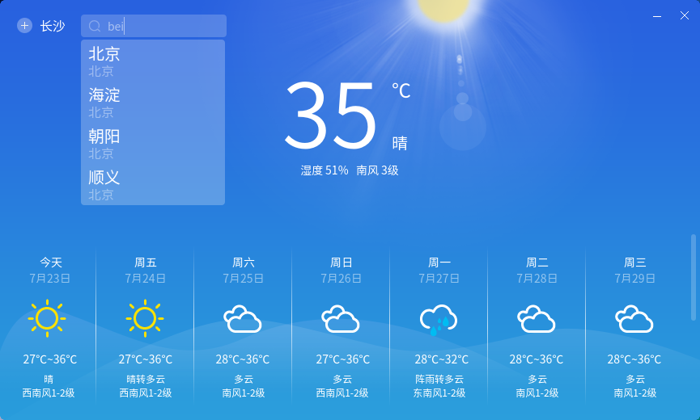

### 基本功能
图标及其功能介绍：

|图标	|图标功能说明|	图标|	图标功能说明
| :------------ | :------------ | :------------ | :------------ |
||	搜索附近的设备||将这个设备添加至已知设备列表
||	与设备进行配对||将这个设备标记/取消标记为信任
||	为此设备运行设置助理||将这个设备从已知设备列表中删去
||	向此设备发送文件||使用obrx ftp浏览这个设备

 

#### 查找设备
用户通过点击“”图标，可对附近蓝牙设备进行搜索，如图 27所示。

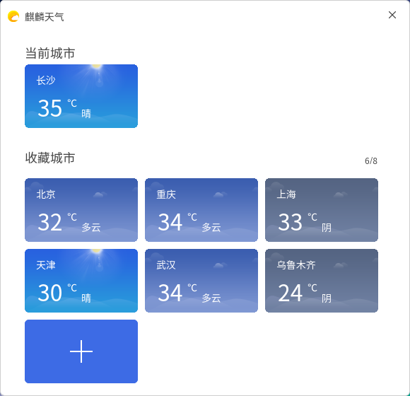

#### 配 对  
用户通过点击“”图标或单击鼠标右键选中的设备，可对选中的设备进行配对，如图 28所示。

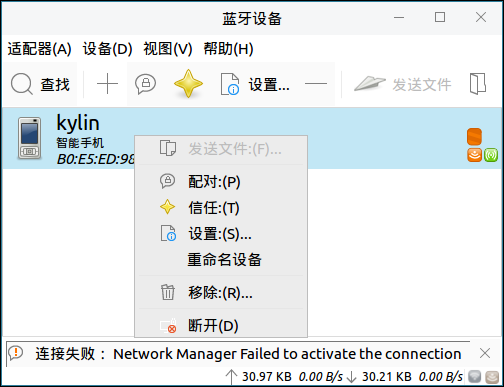

当出现配对图标“”时，表明配对成功。

#### 标记或取消信任
用户通过点击“”图标或单击右键选中的设备，可将当前设备标记为信任。

#### 移除设备
用户通过点击“”图标或单击右键选中设备，可移除当前已配对设备。

#### 发送文件
用户通过点击“”图标或单击右键选中设备，可向当前设备发送文件。

### 高级功能
用户可以通过菜单的适配器、设备、视图、帮助选项，对蓝牙管理器进行相关操作。

图标及其功能介绍：

|图标	|图标功能说明|	图标|	图标功能说明
| :------------ | :------------ | :------------ | :------------ |
||	设置		||退出蓝牙管理器
||	给选中设备发送文件	||	移除选中设备
||	与选中设备断开连接	||	插件
||	本地服务（对网络和传输进行设置）	||	进入问题反馈网址
||	查看关于蓝牙管理器信息		||||

 

#### 适配器选项
用户可以通过点击：菜单 > 适配器 > 设置，对蓝牙管理器进行可见设置和名称设置，如图 29所示。

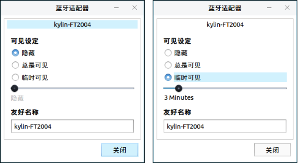
