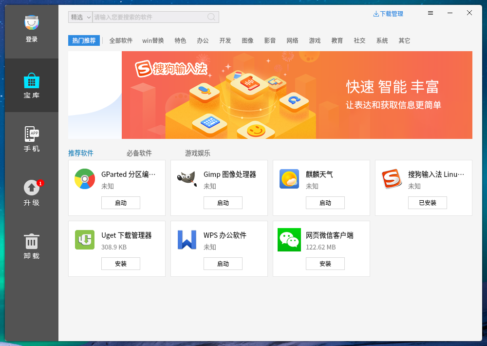
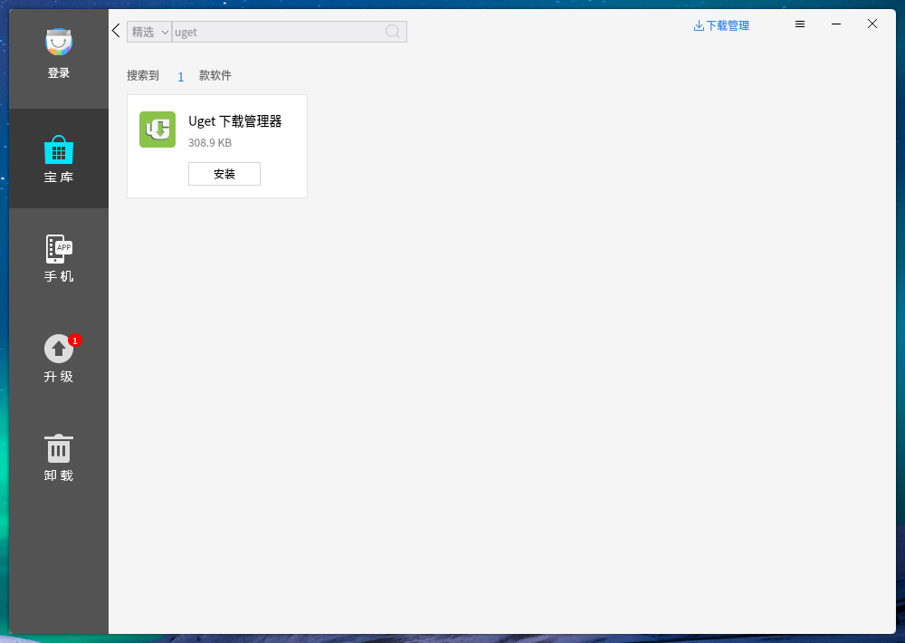
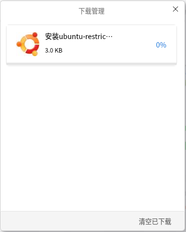
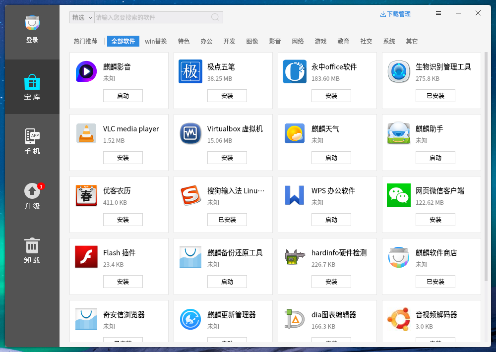
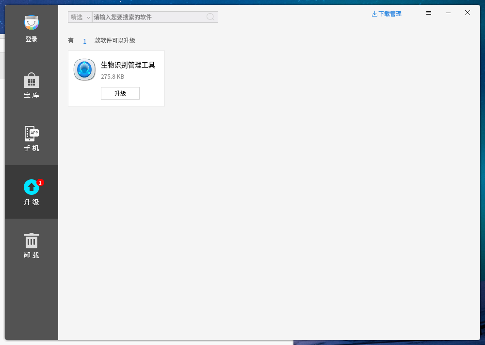
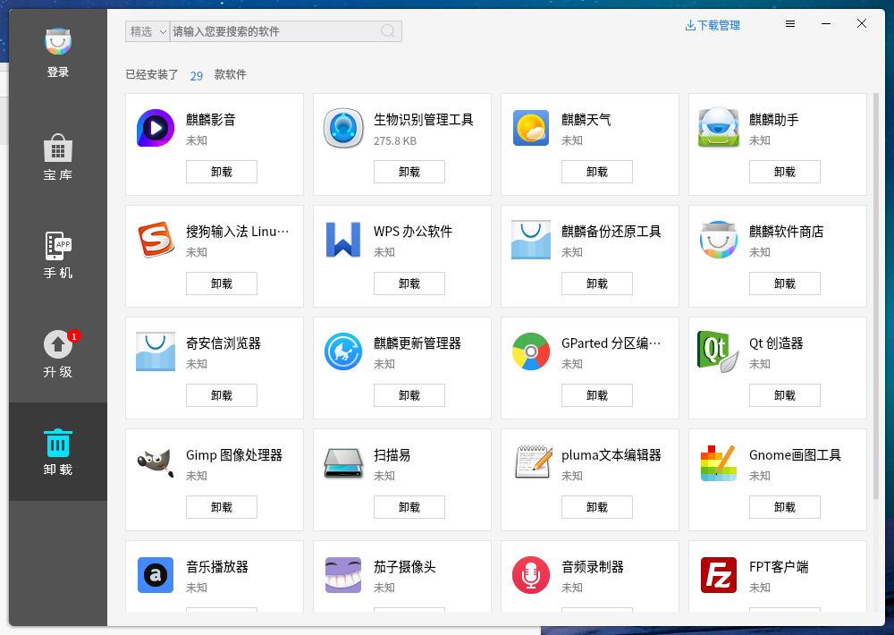
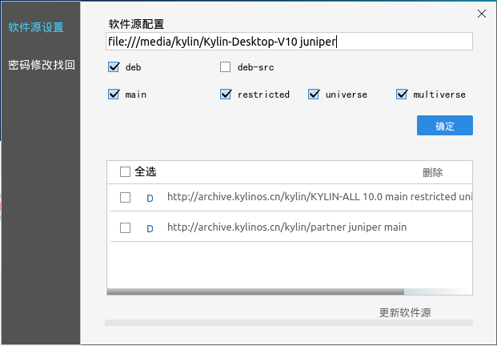
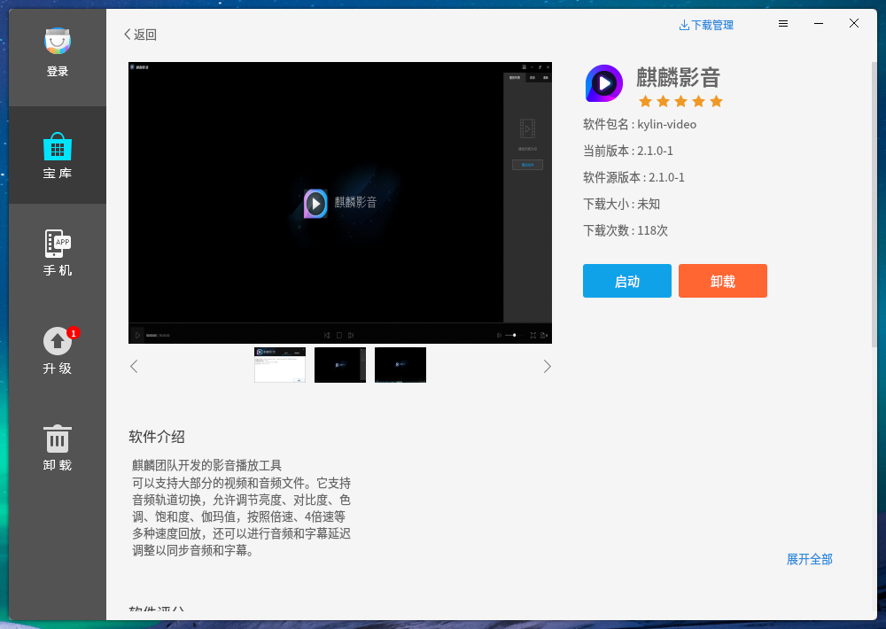
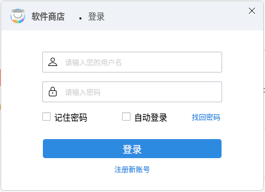
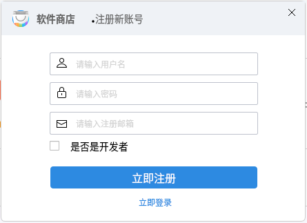

#  麒麟软件商店
## 概 述
麒麟软件商店是一款帮助用户管理软件和编辑软件源的图形化工具，具备应用搜索、安全下载、在线安装、一键卸载、升级等功能特性，给用户提供轻松、友好、安全的软件管理体验。

软件商店中显示的应用是根据软件源来进行动态加载，会为用户推荐常用软件和高评分软件，同时可通过软件分类信息和搜索，方便快速查找。

 

## 基本功能
在主界面可以看到软件商店的广告界面、搜索栏、软件分类栏、下载管理、推荐软件。

### 搜索应用

在搜索框中输入关键字，按下Enter键或点击搜索图标，显示包含关键字的应用。

- 全局搜索：是在软件源下搜索全部应用软件，搜索到的软件可能会有不可用或者其他质量问题。

- 精选搜索：是在测试筛选过的软件中进行搜索，默认为精选搜索。

在手机、升级、卸载标签页中搜索，是在当前界面软件中搜索。

### 下载管理
点击下载管理图标，可以看到下载界面，如图3所示。

### 宝 库
在宝库界面，对软件进行了分类，可以在某个分类中快速找到自己的应用。“全部软件”页面如图4所示。

### 手 机
该标签页下，提供了安卓兼容的功能，能够让用户在系统中安装和运行安卓系统的应用程序，比如安卓游戏、QQ、股票等。

注：部分平台暂不支持该功能。

### 升 级
升级界面可以看到当前有哪些可以升级，如图5所示。

### 卸 载
可以看到系统已经安装并能卸载的软件列表，如图6所示。

 

## 高级功能
### 设置界面
点击设置按钮，进入设置界面，在设置界面可以对软件源进行编辑，如图7所示。

- 需要勾选的项保持默认即可，“deb-src”是用于获取软件源码。

- 以光盘源为例，“file:///media/kylin/Kylin-Desktop-V10”，从“/media”开始，是指光盘挂载的路径，其中“kylin”为用户名。

- “juniper”，是指软件包的系列。

完成后，“确定” > “更新软件源”。

### 交互界面
点击任意一款软件，进入详情界面，如图8所示。

包含软件包名、当前版本、简要介绍、评分评论等信息。软件截图显示可点击前后按钮，进行切换。

### 登录与注册
点击主界面左上角登录按钮，弹出如图9的登录界面。登录后可对软件进行评分评论。

若没有账号，可点击“注册新账号”，如图10所示。

 

## 常见问题
### 使用需要事项
由于服务器IP搭建前是未知的，因此客户端采用域名形式访问服务器，有两种方法解析：

1）在局域网路由中做DNS解析，将服务器IP解析为：service.ubuntukylin.com，所有客户端即可正确访问。

2）客户端机器在 /etc/hosts 中将服务器IP映射为：service.ubuntukylin.com，该机器即可正确访问。
