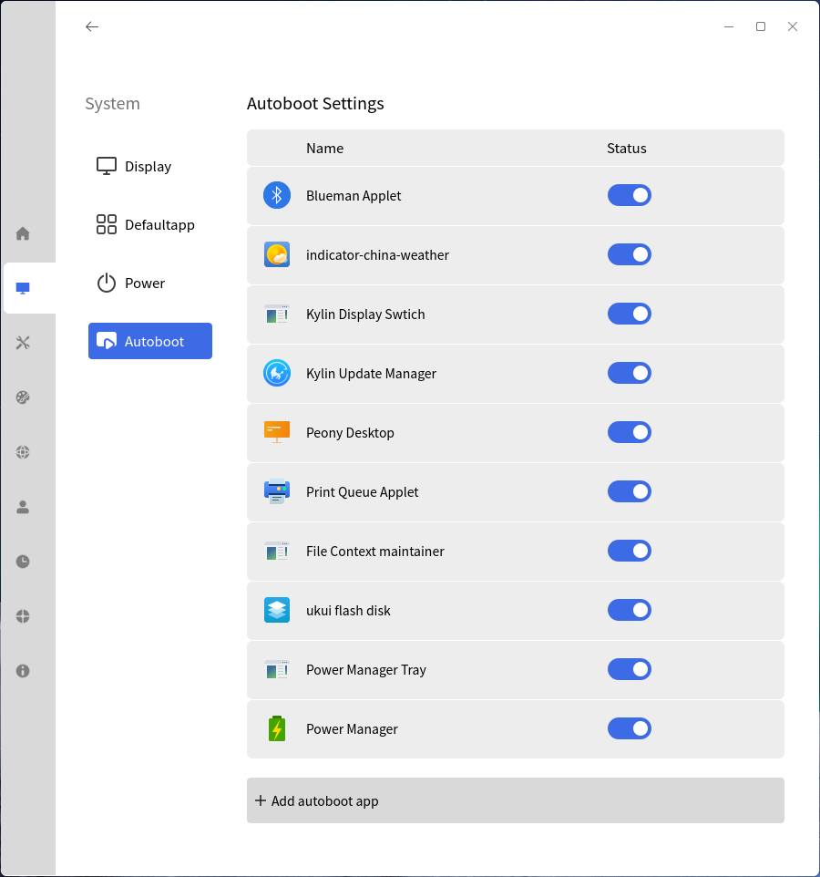
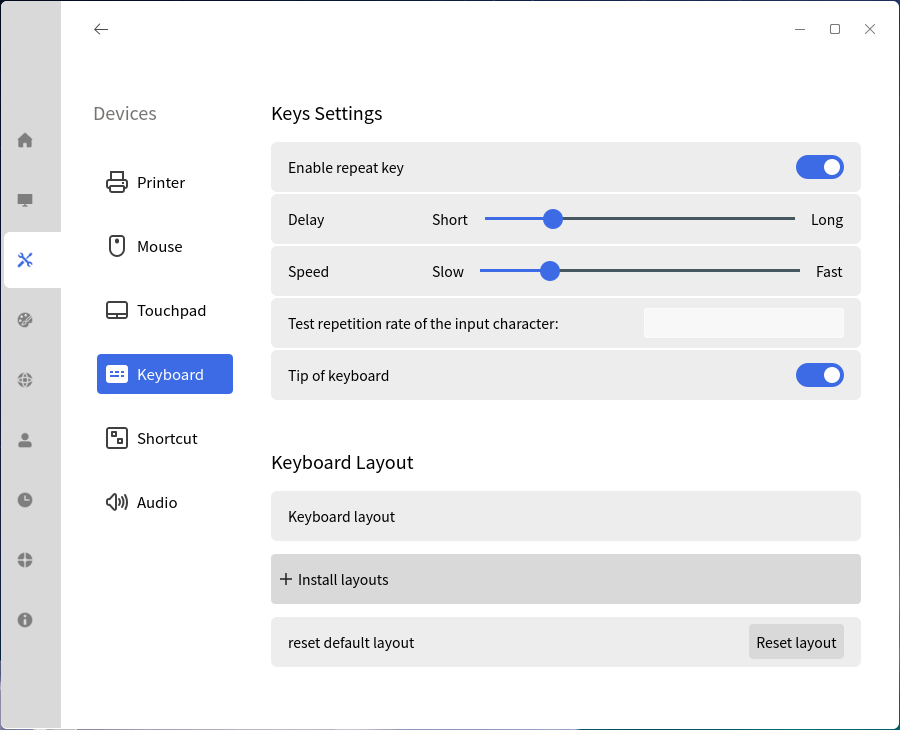
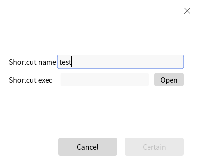
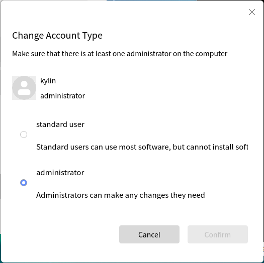
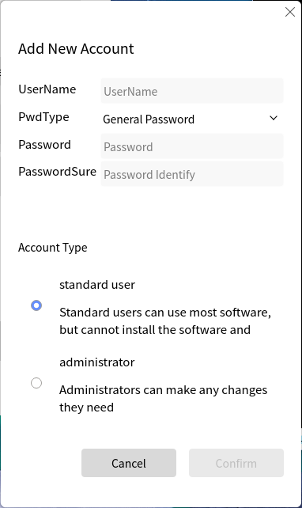
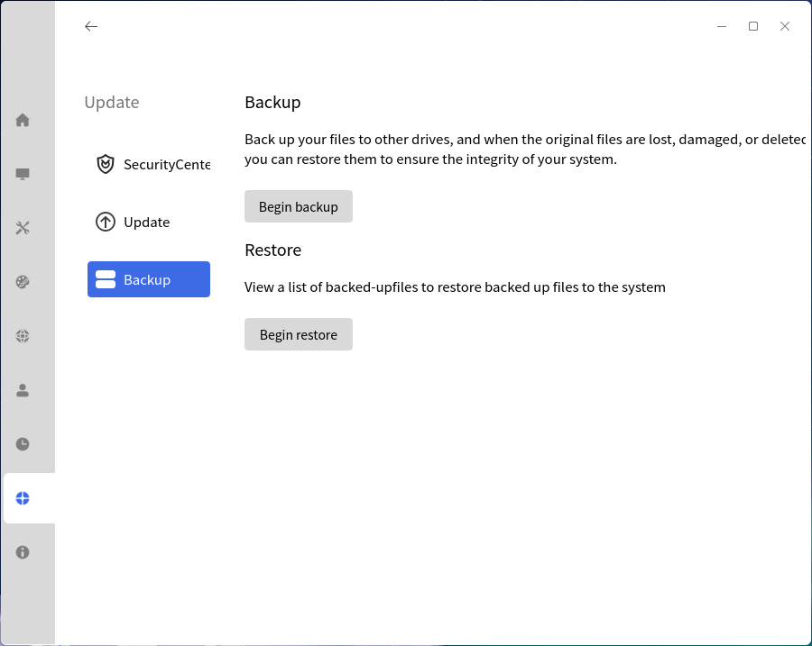

# Ukui Control Center
## Overview
Ukui Control Center provides a friendly graphic interface to set the system. As shown in Fig 1.

 

## System
### Display
As shown in Fig 2.

- monitor：Select current monitor

- resolution, orientation, refresh rate, screen zoom are all for the current active monitor.

### Defaultapp
As shown in Fig 3, browser, mail, image viewer, audio player, video player, text editor can be changed.

### Power
- Provide "Balance", "Saving", "Custom" modes.

- "Custom" includes "Power supply" and "Battery supply".

- Can set power icon.

### Autoboot
List shows the existed autoboot applications.

Click "+" can add apps.

 

## Devices
### Mouse
Customize the mouse key, pointer settings.

### Keyboard
Set the keyboard's general items, and adjust the layout by the language.

- Enable repeat key: Long press one button will be recognized to repeat input.

- Delay: The time between press button and receive input.

- Speed: The time between repeat input.

- Layout: Up to 4 layouts can be added.

### Shortcut
View all the system shortcuts and custom shortcut.

Click "Add custom shortcut" and the popup as shown in Fig 9.

### Audio
Settings for output, input and system sound, as shown in Fig 10.

 

## Personalized
### Background
Here are "picture" and "color" can be selected.

### Theme

- Theme Mode:

- Icon theme and cursor theme:

### Screenlock
Select the picture that shows in login interface.

### Fonts
Settings for font, size, monospace font, and more items are in "Advanced settings"

Click "Reset to default" to restore the settings to default status.

### Screensaver
Set the screensaver program and idle time.

### Desktop
Set the icons lock on Start Menu and Tray Menu.

 

## Network
It includes "Netconnect", "Vpn" and "Proxy". Here only introduct "Netconnect".

### Set Wired Connection
1) Click "Networking settings" to open the setting window.

2) Click "Add" and choose "Ethernet". In the "Ethernet" tab can select device.

3) In the "IPv4 Settings" tab can edit the net configuration.

4) Click "Save", and the system will use this connection automatically.

## Account
Manage all the system users, create/delete users, and modify users' informations.

### Current User
#### Change User Face
Click user's face can change it.

#### Change Password
Click "Change Pwd" to modify the current user's password.

#### Change Account Type
- administrator: Input user's password can elevated permission temporarily

- standard user: Can't elevated permission.

### Other Users
Administrator can modify other user's information, add new user, etc..

- Add new user

- Edit

 

## Datetime
As shown in Fig 26:

- Sync system time: Sync the time on the Internet NTP server.

- Change time: Manual set the time and date.

- Change time zone:

### Area

- change format of data: Customize calendar, first day of week, date, time.

- first language: Language in system windows, menus and website. 

Click "Add main language" to add others.

 

## Update
### SecurityCenter
An access of security center.

### Update
Check if there are available update for the system.

### Backup
- Backup: Back up files to other devices.

- Restore: View backup list and restore the system to one of them.

 

## Messages
### Notice
As shown in Fig 34.

### About
Show the system version, authentication, etc..
 
