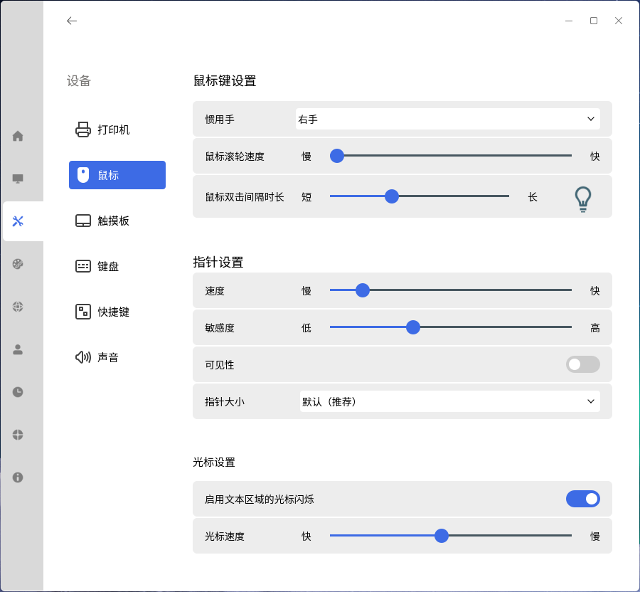
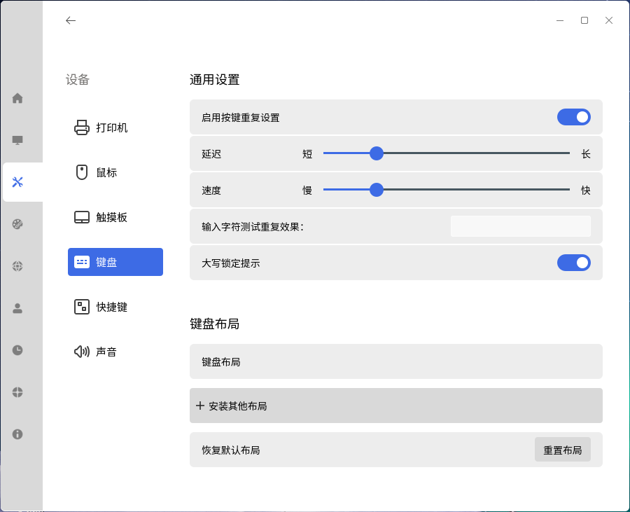
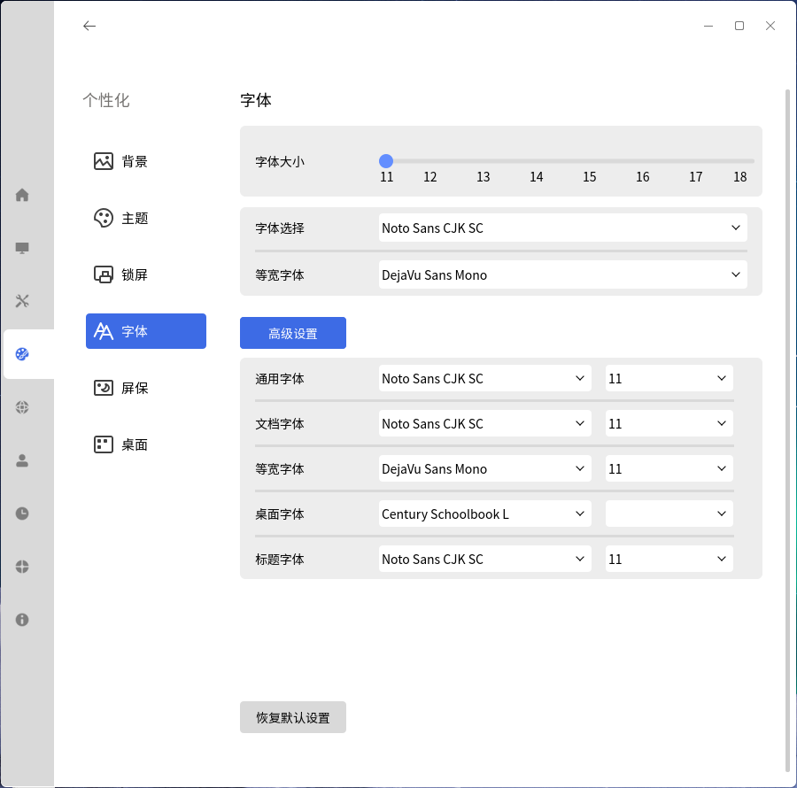
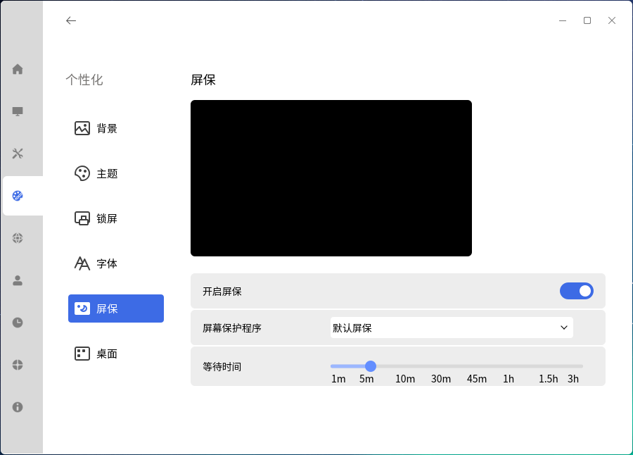
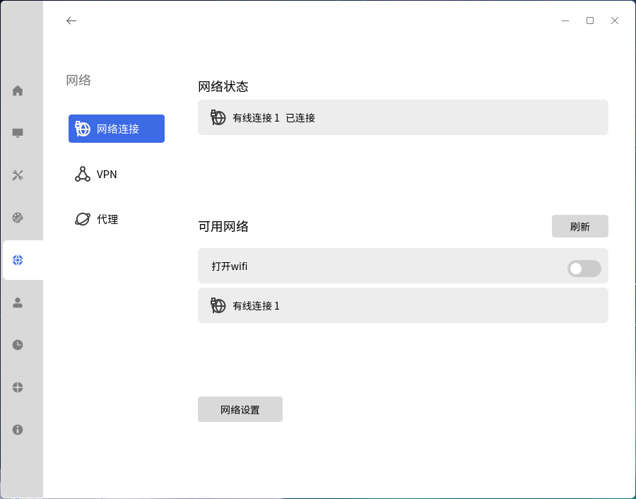
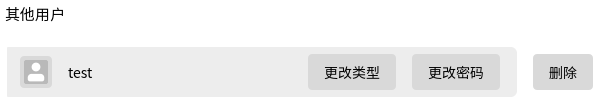
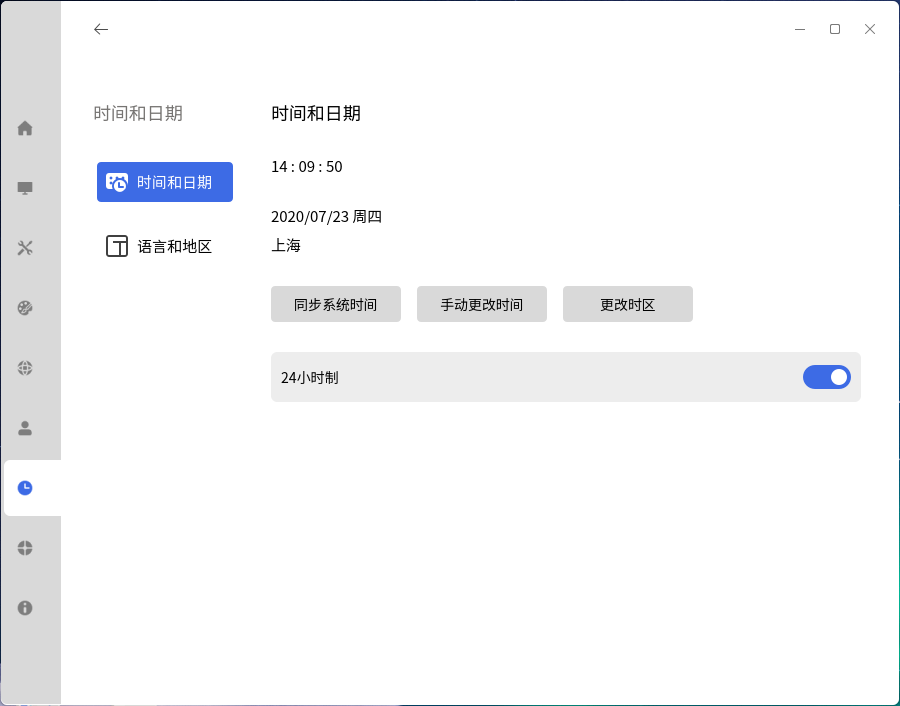

# 控制面板
## 概述
控制面板提供了一个友好的图形用户界面，用于对操作系统常用配置项进行管理。主界面如图 1所示。

 

## 系 统
系统配置设置提供了显示器、默认应用、电源、开机启动四个模块。

### 显示器
显示器可以配置显示相关的设置，上方彩色矩形代表当前屏幕，中间显示了显示器名称及接口名，如图 2所示。

- 显示器：选择当前显示器

- 分辨率、方向、刷新率、缩放屏幕的修改都是针对当前活动显示器

### 默认应用
默认应用可以修改浏览器、电子邮件、图像查看器、音频播放器、视频播放器、文本编辑器六种类型的默认打开应用。主界面如图 3所示：

### 电 源
- 提供平衡、节能、自定义模式

- 自定义包含电源供给和电池供给两种情况

- 可设置电源图标显示

### 开机启动
- 列表中显示了当前系统已存在的开机启动软件

- 右侧的开关按钮代表了左侧软件的开机启动状态

#### 添加
点击“+”，可添加开机启动应用

（1）填写“程序名”；

（2）填写“程序路径”，或者通过点击“浏览”按钮，在弹出文件选择界面，选择以desktop为后缀的文件；

（3）“程序描述”作为可选项，可填可不填；

（4）最后点击“确定”按钮，新的启动项即被创建并显示在列表中；

（5）新建的启动项默认为开机启动状态。

 

## 设 备
设备设置提供了打印机、鼠标、键盘、快捷键、声音、触摸板六个设置模块。

### 鼠 标
对鼠标键、鼠标指针进行个性化设置。

### 键 盘
对键盘进行常规通用设置，并能够根据键盘语言调整键盘布局。

- 启用按键重复设置：按下某个按键不放，系统会将该行为作为重复的键盘输入。启用按键重复设置后，可对延时、速度两个选项进行设置。

- 延时：按下按键后，到系统开始接收键盘输入之间的间隔

- 速度：按下按键后，重复输入之间的间隔；间隔越长，同样时间内，重复输入的次数越少

- 键盘布局：设置当前系统的键盘布局，最多可以添加4个键盘布局。

### 快捷键
查看所有快捷键，添加或删除自定义快捷键。

点击“添加自定义快捷键”，弹出添加窗口。

Tips：为保证命令合法有效，若快捷键被占用，会在下方给出提示。

### 声 音
对输入、输出和系统音效进行设置，如图 11所示。

- 声道平衡：靠近“左”方向为左声道，靠近“右”为右声道

- 输入等级：配置声音输入设备的高低等级

 

## 个性化
个性化设置提供了背景、主题、锁屏、字体、屏保、桌面六个模块。

### 背 景
针对桌面背景，提供两种背景形式的选择：纯色、图片。

### 主 题
主题包括主题模式、图标主题、光标主题、效果设置

- 主题模式：

- 图标主题和光标主题：

### 锁 屏
选择在登录界面显示的背景图片，且可对电脑开启锁屏的时间进行设置。

### 字 体
对字体、大小、等宽进行常规设置，在高级设置里提供相应字体的设置。

点击“恢复默认设置”按钮将所有字体设置还原为系统默认状态。

### 屏 保
设置屏保程序、等待时间。

### 桌 面
设置开始菜单为全屏，锁定在开始菜单的图标和托盘上的图标。

 

## 网 络
网络代理主要是配置网络代理相关设置：网络连接、VPN、代理。此处主要说明介绍网络连接。

### 配置有线网络
（1）点击“网络设置”，打开网络连接窗口。

（2）点击“增加”，并选择“以太网”。在编辑窗口的“以太网”标签页，可选择设备。

（3）在“IPv4”标签页，可配置网络。

（4）完成后点击“保存”，系统会自动连上新增的网络。

### 多IP配置
一个网卡配置多个IP的作用：连接多个网段。比如：同时连接外网和局域网，避免网络来回设置的麻烦。

此功能需要这些网段的物理层是连通的。

当鼠标悬停在IP地址配置框时，会有提示文字。

多IP配置方法：

（1）打开编辑网络连接的页面，输入IP地址与掩码，如图所示（图中的地址仅为示例）。

（2）点击图 24中右下角的“路由”按钮，在弹窗中填入IP的具体信息，并勾选“仅将此连接用于相对应的网络上的资源”。

（3）若不同IP需要的DNS也不同，可通过在终端执行命令 “sudo vim /etc/resolv.conf”，对配置文件进行修改。

 

## 账 户
对系统用户进行管理配置，允许管理员创建用户、删除用户、修改用户信息。

### 当前用户
#### 更改用户头像
点击用户头像，即可进行修改，图片可从本机图片中选择。

#### 更改密码
点击“更改密码”，即可修改当前用户的密码。

#### 更改账户类型
系统用户类型分两种：标准用户和管理员用户。

- 管理员用户：输入用户密码，可以临时提升root权限

- 标准用户：无法提升权限。

Tips：系统至少需要存在一个管理员用户。

### 其他用户
可编辑其他用户信息，添加新用户，删除用户等。

- 添加新用户

点击“添加新用户”，定义账户名称、密码、账户类型等如图 41所示。

- 编辑用户

 

## 时间和日期
主界面如图所示：

- 同步系统时间：与互联网上的NTP服务器时间同步，此状态下不再允许修改时间或日期

- 手动更改时间：需要先取消“同步系统时间”，手动设置时间和年月日

- 时间格式分12小时和24小时，点击右侧开关立即生效

- 更改时区：如下图所示，根据个人需求进行选择

### 语言和地区
主界面如图所示:

- 更改数据格式：自定义日历、一周第一天、日期、时间

- 首选语言：系统窗口、菜单及网页的显示语言，首选推荐语言为简体中文。

点击“添加首选语言”，可添加其他地区语言作为备选。

 

## 更 新
可检测系统是否有更新内容。

### 备 份
- 开始备份：将文件备份到其他驱动器

- 开始还原：查看备份列表，并选择还原点进行恢复。

 

## 通知和操作
### 通 知
如图所示：

### 关 于
显示本机系统的版本、设备规格、授权激活信息。

 

## 常见问题
### 点击开始菜单上的控制面板按钮，无反应
在键盘上按下 Ctrl + Alt + T 组合键打开命令行终端，输入“ukui-control-center”后按下回车，查看错误输出。

### 修改控件状态后，控件立刻还原到修改前状态
大概率是因为权限问题。

在键盘上按下 Ctrl + Alt + T 组合键打开命令行终端，输入“rm ~/.config/dconf/user”后按下回车。

