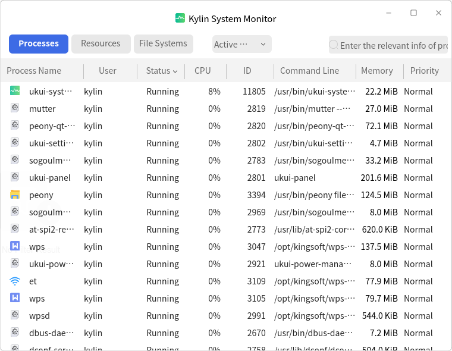
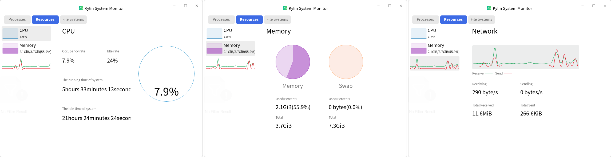
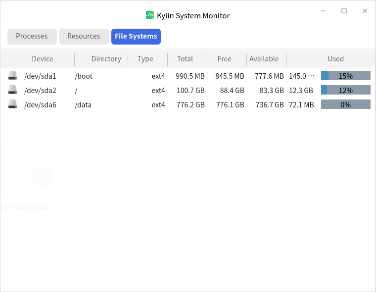
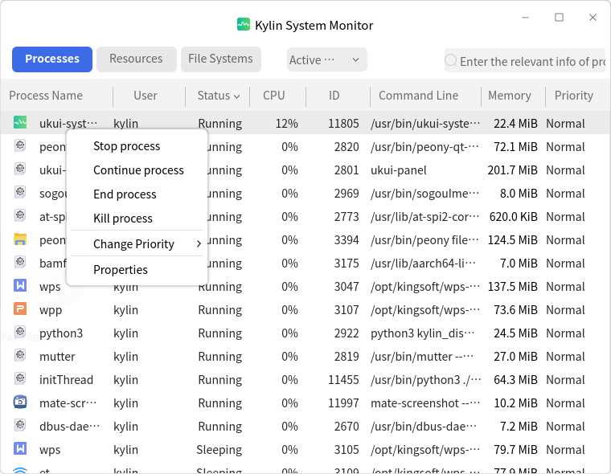
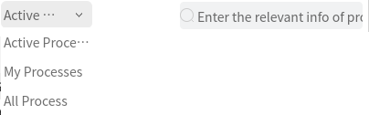

# Ukui System Monitor
## Overview
Ukui System Monitor is used to view system processes, resources and file systems, and it supports to monitor system usage dynamically. The main interface as shown in Fig 1.

 

## Basic Function
### Processes
Click "Processes" tab to see the current running processes' informations. As shown in Fig 1.

### Resources
Click "Resources" tab to see the used resources details dynamically at the cunrrent system runtime, including CPU, memory, network. As shown in Fig 2.

### File Systems
Click "File Systems" tab to see the informations, including device, directory, type, etc..

 

## Advanced Function
### Processes Options
Select a process and right click, and users can choose the opearation for this process. As shown in Fig 4.

### Processes Filter
As shown in Fig 5, users can choose the processes shown on the window, or search one process by key words.

