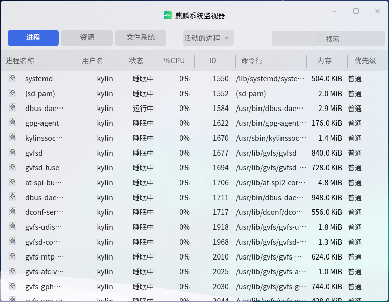
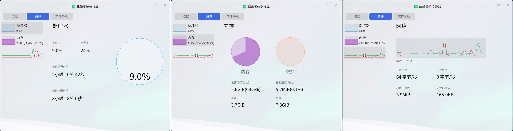
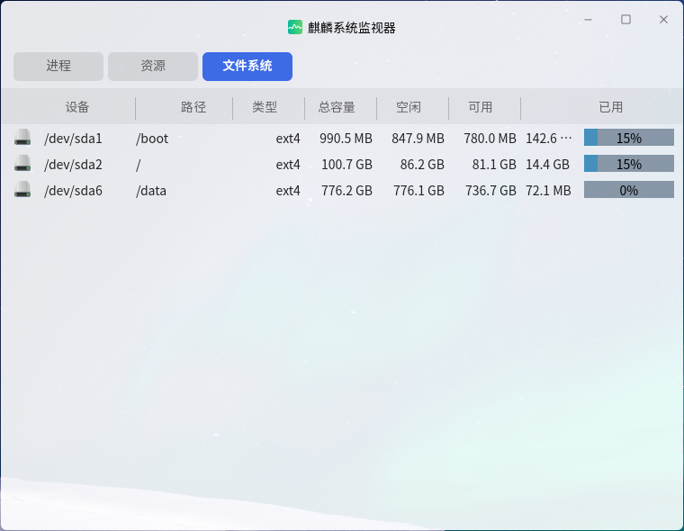
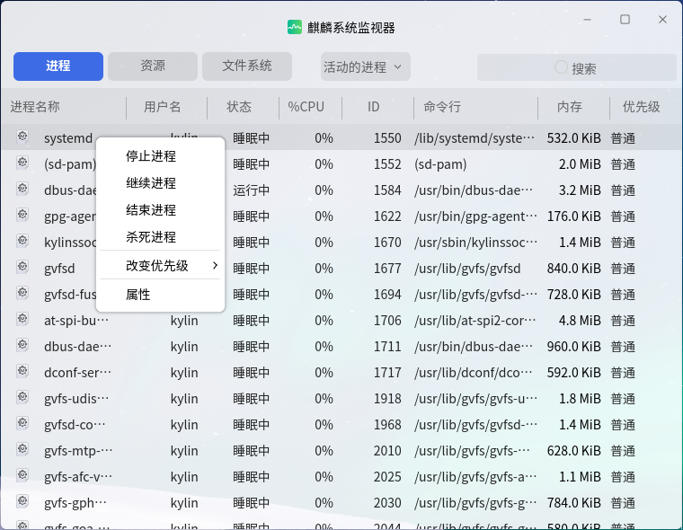

# 麒麟系统监视器
## 概 述
麒麟系统监视器是一款可以查看进程、资源、文件系统的图形化系统应用工具，能动态地监视系统的使用情况，主界面如图 1所示。

 

## 基本功能
### 进 程
“进程”标签页可查看当前系统所运行的进程信息，如图 1所示。

### 资 源
“资源”标签页可动态地查看当前系统所使用的资源信息，如图 2所示。

### 文件系统
“文件系统”标签页可查看设备信息，如图 3所示。

 

## 高级功能
### 进程选项
在“进程”标签页中，右键单击某个进程，可选择停止/继续/结束/杀死进程，修改进程进行优先级，查看进程属性，如图 4所示。

### 进程筛选
如图 5所示，可在下拉框中选择要显示的进程，或是在搜索框中查找某个进程。

