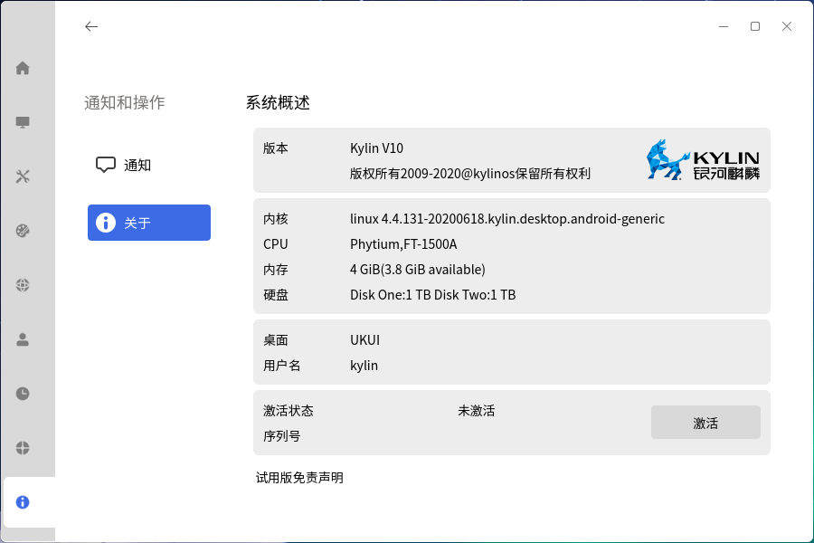
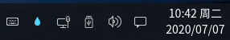
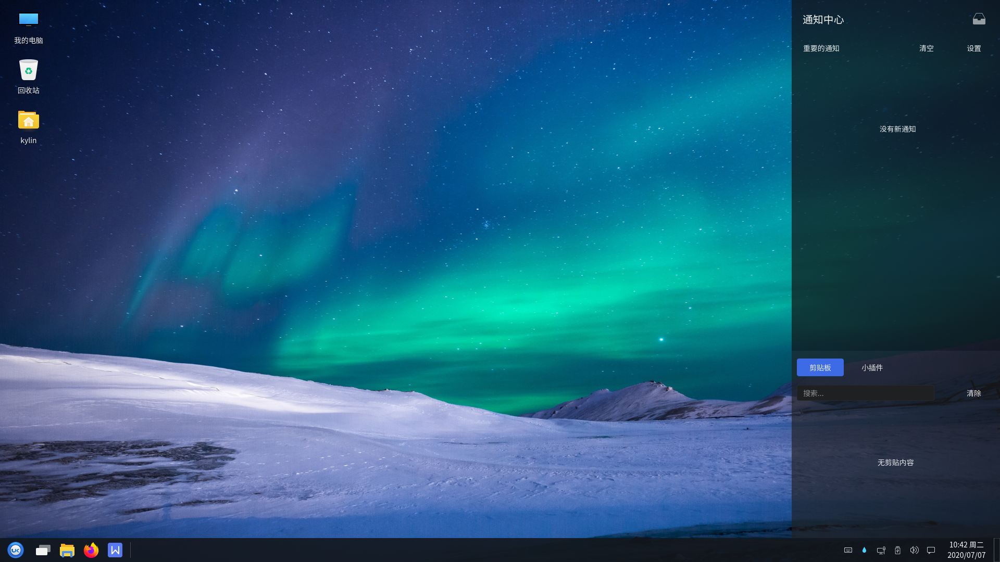
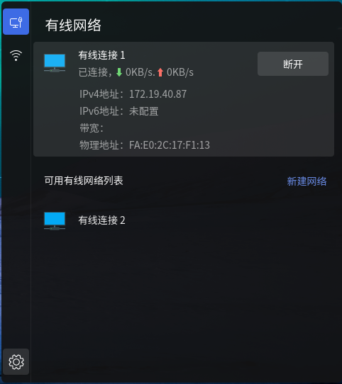

# 基础桌面环境
桌面是用户进行图形界面操作的基础，提供了多个功能部件，包括任务栏、开始菜单等，主界面如图 1所示。

 

## 桌 面
### 桌面图标
系统默认放置了计算机、回收站、个人三个图标，鼠标左键双击即可打开页面。功能如下表所示。 

|图标|	说明
| :------------ | :------------ |
|| 计算机：显示连接到本机的驱动器和硬件
|| 回收站：显示除移的文件
|| 主文件夹：显示个人主目录

 

另外，右键单击“计算机”，选择“属性”，可显示当前系统版本、内核版本、激活等相关信息，如图 2所示。

### 右键菜单
在桌面空白处单击鼠标右键，出现的菜单如图 3所示，为用户提供了一些快捷功能。

部分选项说明如下。

|选项	|说明
| :------------ | :------------ |
|新建	|可新建文件夹、文本文档、WPS文件
|视图类型	|提供四种视图类型：小图标、中图标、大图标、超大图标
|排列方式	|提供多种排列图标的方式

 

## 任务栏
任务栏位于底部，包括开始菜单、文件浏览器、Firefox网络浏览器、WPS、托盘菜单等，如图 4所示。

其各个组件如下。

|组件	|说明
| :------------ | :------------ |
||	开始菜单，用于弹出系统菜单，可查找应用和文件
||	可在多个工作区互不干扰进行操作
||	文件浏览器，可浏览和管理系统中的文件
||	Firefox网页浏览器，提供便捷安全的上网方式
||	WPS办公套件，可以实现办公软件最常用的文字、表格、演示等多种功能
|窗口显示区	|横条中间空白部分；显示正在运行的程序或打开的文档，可进行关闭窗口、窗口置顶操作
||	托盘菜单，包含了输入法、网络连接、日期、夜间模式等
|显示桌面|	按钮位于最右侧；点击后，最小化桌面的所有窗口，再次点击则恢复窗口

 

### 工作区
点击任务栏“”图标，即可进入如图 5所示界面，选择当下需要的工作区。

### 预览窗口
用户将鼠标移动到任务栏的应用图标上，会对该应用打开的窗口进行小窗口预览，如图 6所示，悬停在指定窗口，该窗口会呈现毛玻璃效果，如图右侧，其余为默认状态。

鼠标右键点击任务栏的应用图标，可关闭该应用当前打开的所有窗口，如图 7所示。

### 侧边栏
点击任务栏右侧托盘菜单中的侧边栏图标，弹出界面如图 8所示。侧边栏由两部分构成：通知中心和剪切板。

#### 通知中心
通知中心将会显示重要的近期最新的重要信息列表。选择右上角“清空”可将信息列表清空，“设置”跳转进入控制面板的通知设置界面。

#### 剪切板
剪切板可保存近期选择复制或剪切的内容，同时可通过下表中说明的图标进行相应操作。

|图标|	说明|	图标	|说明
| :------------ | :------------ | :------------ | :------------ |
||	复制剪切板上的该内容	||	编辑剪切板上的该内容
||	删除剪切板上的该内容	||||	

 

剪切板的第二个标签为小插件，包含：闹钟、便笺本、用户反馈。

### 输入法
系统提供了多个输入法供用户选择，右键点击输入法图标，选择“输入法”即可看到，如图所示。

### 网 络
用户通过鼠标左键点击任务栏上的网络工具图标，可根据需要选择有线和无线两种网络连接方式。

|图标	|说明|	图标	|说明
| :------------ | :------------ | :------------ | :------------ |
||	网络已连接	||	网络未连接
||	网络连接受限	||	网络已上锁
||	网络正在连接	||	Wifi已连接
||	Wifi未连接	||	Wifi连接受限
||	Wifi已上锁	||	Wifi正在连接

 

#### 1）有线网络
点击有线网络即可展开，查看网络的详细信息。

#### 2）无线网络
无线网络连接，点击右上角开关按钮打开无线网络连接，并在可用无线网络列表中选择需要连接的WiFi，并键入密码即可通过WiFi上网。

### 日 历
鼠标左键点击任务栏上的时间日期，弹出日历窗口。

用户可筛选年、月、日查看某日信息，并有当日的节气、农历，宜忌可点击下方勾选查看。

### 高级设置
右键单击任务栏，用户可对任务栏的布局进行设定。

 

## 窗口管理器
窗口管理器为用户提供了如下所示的功能。

|功能	|说明
| :--------| :----------|
|窗口标题栏|	显示当前窗口的标题名称
|最小化/最大化/关闭	|标题栏右侧的三个图标按钮，分别对应最小化窗口、最大化窗口、关闭窗口的功能
|侧边滑动	|在窗口右侧提供滑动条，可上下滚动查看页面
|窗口堆叠|	允许窗口之间产生重叠
|窗口拖拽	|在窗口标题栏长按鼠标左键，可移动窗口到任意位置
|窗口大小调整	|将鼠标移至窗口四角，长按左键，可任意调整窗口大小

 

### 窗口切换
用户有三种方式可以切换：

* 在任务栏上点击窗口标题

* 在桌面上点击不同窗口

* 使用快捷键 Alt + Tab

 

## 开始菜单
单击“开始菜单”按钮，如图所示，为按字母排序显示系统应用。

### 分类菜单
右侧边提供三种分类方式：“所有软件”、“字母排序”、“功能分类”，其中：

* 所有软件：列出系统中所有软件

* 字母排序：根据首字母分类显示系统所有软件

* 功能分类：根据功能分类显示系统所有软件

点击右上角的全屏图标，进入全屏菜单。

### 快捷功能键
#### 用户信息
点击“”，查看用户信息。

#### 计算机
点击“”，进入文件管理器的计算机目录。

#### 控制面板
点击“”，进入控制面板。

### 关机菜单
点击“电源”按钮，弹出的关机选项界面如图所示。

#### 锁定屏幕
当用户暂时不需要使用计算机时，可以选择锁屏（不会影响系统当前的运行状态），防止误操作；用户返回后，输入密码即可重新进入系统。在默认设置下，系统在一段空闲时间后，将自动锁定屏幕。

#### 切换用户和注销
当要选择其他用户登录使用计算机时，可选择“注销”或“切换用户”。此时，系统会关闭所有正在运行的应用；所以，在执行此操作前，请先保存当前工作。

#### 关机与重启
右键单击开始菜单，也会出现关机菜单选项。

### 应 用
用户可以在搜索框中，通过关键字搜索应用。如搜索用户手册，可输入“yong”，查询结果会随着输入自动显示出来。

右键点击开始菜单中的某个应用，可将选中应用固定到“所有软件”/任务栏，添加到桌面快捷方式，或是卸载该应用。

 

## 常见问题
### 任务栏不显示
（1）通过Ctrl + Alt + T打开终端。

（2）执行命令“sudo mate-panel --reset”，重新启动任务栏。

（3）若依然未生效，可执行命令“reboot”，重启系统。

### 锁屏后无法登录系统
（1）通过Ctrl + Alt + F1切换到字符终端。

（2）输入用户名和密码后登录。

（3）执行命令“sudo rm -rf ~/.Xauthority”。

（4）通过Ctrl + Alt + F7切回图形界面，输入用户密码登录。

 

## 附 录
### 快捷键

|快捷键	|功能
| :------ | :-----
|F5|	刷新桌面
|F1	|打开用户手册
|Alt + Tab	|切换窗口
|win	|打开开始菜单
|Ctrl + Alt + L|	锁屏
|Ctrl + Alt + Delete|	注销
|Ctrl + Alt + F1~6	|切换至字符系统界面
|Ctrl + Alt + F7	|切换至图形界面
